# Fast Data Transformation with data.table

## Basics

```{r setup, include=FALSE}
knitr::opts_chunk$set(echo = TRUE)
```

```{r}
library(data.table)
```

data.table is an extremely fast and memory efficient package for transforming data in R. It works by converting R’s native data frame objects into data.tables with new and enhanced functionality. The basics of working with data.tables are:

```{r echo = FALSE, out.width = "30%"}
knitr::include_graphics("myss/data.table/dt.png")
```


- Take data.table **dt**,
- subset rows using **i**,
- manipulate columns with **j**,
- grouped according to **by**.

data.tables are also data frames – functions that work with data frames therefore also work with data.tables.


## Create a data.table

create a data.table from scratch. Analogous to data.frame()

```{r}
data.table(a = c(1, 2), b = c("a", "b"))
```

convert a data frame or a list to a data.table.


```{r eval=FALSE}
as.data.table(df)
setDT(df)
```


* SET FUNCTIONS AND :=
data.table’s functions prefixed with “set” and the operator “:=” work without “<-” to alter data without making copies in memory. 
E.g. the more efficient “setDT(df)” is analogous to “df <- as.data.table(df)”.


## Subset rows using i

<div class="grid-container_2to1">
<div class="grid-item">
```
# subset rows based on row numbers.
dt[1:2, ] 
```
</div>
<div class="grid-item">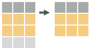</div>

<div class="grid-item">
```
# subset rows based on values in one or more columns.
dt[a > 5, ] 
```
</div>
<div class="grid-item">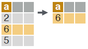</div>

</div>

**LOGICAL OPERATORS TO USE IN i**

>   <,   <=,   >,   >=,  is.na(),  !is.na(), 
>   %in%,   !,   |,   &,   %like%,   %between%


## Manipulate columns with j

**EXTRACT**

<div class="grid-container_2to1">
<div class="grid-item">
```
# extract column(s) by number. Prefix column numbers with “-” to drop.
dt[, c(2)] 
```
</div>
<div class="grid-item"></div>

<div class="grid-item">
```
# extract b c b c column(s) by name.
dt[, .(b, c)] 
```
</div>
<div class="grid-item">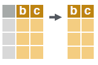</div>

</div>


**SUMMRIZE**

<div class="grid-container_2to1">
<div class="grid-item">
```
# create a data.table with new columns based on the summarized values of rows.
dt[, .(x = sum(a))]
```
</div>
<div class="grid-item"></div>

</div>

Summary functions like mean(), median(), min(), max(), etc. may be used to summarize rows.


**COMPUTE COLUMNS**

<div class="grid-container_2to1">

<div class="grid-item">
```
# compute a column based on an expression.
dt[, c := 1 + 2]
```
</div>
<div class="grid-item"></div>

<div class="grid-item">
```
# compute a column based on an expression but only for a subset of rows.
dt[a == 1, c := 1 + 2] 
```
</div>
<div class="grid-item">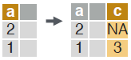</div>

<div class="grid-item">
```
# compute multiple columns based on separate expressions.
dt[, `:=`(c = 1 , d = 2)]
```
</div>
<div class="grid-item">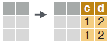</div>


</div>


**DELETE COLUMN**

<div class="grid-container_2to1">
<div class="grid-item">
```
# delete a column.
dt[, c := NULL] 
```
</div>
<div class="grid-item"></div>

</div>


**CONVERT COLUMN TYPE**

<div class="grid-container_2to1">
<div class="grid-item">
```
# convert the type of a column using as.integer(), as.numeric(), as.character(), as.Date(), etc.
dt[, b := as.integer(b)] 
```
</div>
<div class="grid-item"></div>

</div>


## Group according to by

<div class="grid-container_2to1">
<div class="grid-item">
```
# group rows by values in specified column(s).
dt[, j, by = .(a)]
```

```
# group and simultaneously sort rows according to values in specified column(s).
dt[, j, keyby = .(a)]
```

</div>
<div class="grid-item">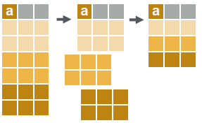</div>

</div>


**COMMON GROUPED OPERATIONS**

```
# summarize rows within groups.
dt[, .(c = sum(b)), by = a]
# create a new column and compute rows within groups.
dt[, c := sum(b), by = a] – 
# extract first row of groups.
dt[, .SD[1], by = a]
# extract last row of groups.
dt[, .SD[.N], by = a]
```


## Chaining

**dt[…][…]**

perform a sequence of data.table operations by chaining multiple “[]”.


## Functions for data.tables

**REORDER**

<div class="grid-container_2to1">
<div class="grid-item">
```
# reorder a data.table according to specified columns. Prefix column names with “-” for descending order.
setorder(dt, a, -b) 
```

</div>
<div class="grid-item">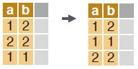</div>

</div>

**UNIQUE ROWS**

<div class="grid-container_2to1">
<div class="grid-item">
```
# extract unique rows based on columns specified in “by”. Leave out “by” to use all columns.
unique(dt, by = c("a", "b"))
```

</div>
<div class="grid-item"></div>

</div>

```
# return the number of unique rows based on columns specified in “by”.
uniqueN(dt, by = c("a", "b"))
```

**RENAME COLUMNS**

<div class="grid-container_2to1">
<div class="grid-item">
```
# rename column(s).
setnames(dt, c("a", "b"), c("x", "y")) 
```

</div>
<div class="grid-item"></div>

</div>

**SET KEYS**

```
# set keys in a data.table to enable faster repeated lookups in specified column(s) using “dt[.(value), ]” or for merging without specifying merging columns “dt_a[dt_b]”.
setkey(dt, a, b)
```

## Combine data.tables

**JOIN**

<div class="grid-container2">
<div class="grid-item">
```
# join two data.tables based on rows with equal values. You can leave out “on” if keys are already set.
dt_a[dt_b, on = .(b = y)]
```

</div>
<div class="grid-item">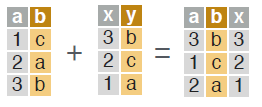</div>

<div class="grid-item">
```
# join two data.tables based on rows with equal and unequal values.
dt_a[dt_b, on = .(b = y, c > z)]
```

</div>
<div class="grid-item">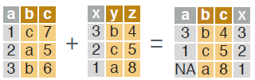</div>

</div>

<br>

**ROLLING JOIN**
<div class="grid-item"></div>

```
# rolling join matches rows, according to id columns, but only keeps the most recent preceding match with the left table, according to date columns. Use “roll = -Inf” to reverse direction.
dt_a[dt_b, on = .(id = id, date = date), roll = TRUE] 
```

**BIND**

<div class="grid-container2">
<div class="grid-item">
```
# combine rows of two data.tables.
rbind(dt_a, dt_b)
```
</div>
<div class="grid-item">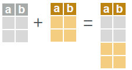</div>

<div class="grid-item">
```
# combine columns of two data.tables.
cbind(dt_a, dt_b) 
```
</div>
<div class="grid-item">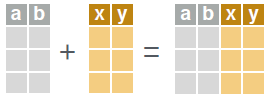</div>

</div>


## Reshape a data.table


**RESHAPE TO WIDE FORMAT**

Reshape a data.table from long to wide format.

<div class="grid-container2">
<div class="grid-item">
```
dcast(dt, id ~ y, value.var = c("a", "b"))
```
</div>
<div class="grid-item">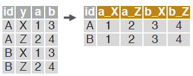</div>

</div>

- **dt** A data.table.
- **id ~ y** Formula with a LHS: id column(s) containing id(s) for multiple entries. And a RHS: column(s) with value(s) to spread in column headers.
- **value.var** Column(s) containing values to fill into cells.


**RESHAPE TO LONG FORMAT**

Reshape a data.table from wide to long format.

<div class="grid-container2">
<div class="grid-item">
```
melt(dt, id.vars = c("id"), 
     measure = patterns("^a", "^b"), 
     variable.name = "y", 
     value.name = c("a", "b"))
```
</div>
<div class="grid-item">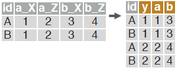</div>

</div>

- **dt** A data.table.
- **id.vars** Id column(s) with id(s) for multiple entries.
- **measure** Column(s) containing values to fill into cells (often in pattern form).
- **variable.name** Name(s) of new column(s) for variables and values derived from old headers.
- **value.name**

## .SD

Refer to a Subset of the Data with .SD.

**MULTIPLE COLUMN TYPE CONVERSION**

```
# convert the type of designated columns.
dt[, lapply(.SD, as.character), .SDcols = c("a", "b")]
```

**GROUP OPTIMA**

within groups, extract rows with the maximum value in a specified column. Also works with which.min() and which(). Similar to “.SD[.N]” and “.SD[1]”.

```
dt[, .SD[which.max(a)], by = b]
```

## Sequential rows

**ROW IDS**

within groups, compute a column with sequential row IDs.


<div class="grid-container2">
<div class="grid-item">
```
dt[, c := 1:.N, by = b]
```
</div>
<div class="grid-item"></div>

</div>


**LAG & LEAD**

within groups, duplicate a column with rows lagged by specified amount.

<div class="grid-container2">
<div class="grid-item">
```
dt[, c := shift(a, 1), by = b]
```
</div>
<div class="grid-item">
```{r echo = FALSE, out.width = "30%"}
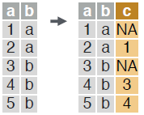
```
</div>


within groups, duplicate a column with rows leading by specified amount.


<div class="grid-container2">
<div class="grid-item">
```
dt[, c := shift(a, 1, type = "lead"), by = b]
```
</div>
</div>

## fread & fwrite

**IMPORT**

fread("file.csv") – read data from a flat file such as .csv or .tsv into R.

fread("file.csv", select = c("a", "b")) – read specified column(s) from a flat file into R.

**EXPORT**

fwrite(dt, file = "file.csv") – write data to a flat file from R.
