## Basics

The [**Data Import cheat sheet**](https://www.rstudio.com/resources/cheatsheets/#import) reminds you how to read in flat files with http://readr.tidyverse.org/, work with the results as tibbles, and reshape messy data with `tidyr`. Use `tidyr` to reshape your tables into tidy data, the data format that works the most seamlessly with R and the tidyverse.

R's **tidyverse** is built around **tidy data** stored in **tibbles**, an enhanced version of a data frame.

* **Readr** read text files into R.

* **tidyr** create tibbles with tibble and to layout tidy data.


## Save Data

Save x, an R object, to path, a file path, as:


<div class="comment_with_line">
These functions share the common arguments: <br>
<strong>write_*</strong>(x, path, na="NA", append=FALSE, col_names=!append)
</div>

<br>

```{R echo=FALSE, message=FALSE, results='asis'}
library(tidyverse)
df <- tribble(
    ~func, ~name, ~delim, ~arguments,
    "write_csv", "Common delimited file", ",", "",
    "write_delim","File with arbitrary delimiter", "any", 'delim="..."',
    "write_excel_csv","CSV for excel", "", "",
    "write_file","String to", "", "",
    "write_lines","String vector to file","","",
    "write_rds","Object to RDS file","",'compress=c("none","gz","bz2","xz")',
    "write_tsv","Tab delimited files","tab",""
    )

knitr::kable(df, caption="Write_* functions")
```

## Read Tabular Data

<div class="comment_with_line">
These functions share the common arguments: <br>
<strong>read_*</strong>(file, col_names=TRUE, col_types=NULL, locale=default_locale(),
na=c("","NA"), quoted_na=TRUE, comment="", trim_ws=TRUE, skip=0, 
n_max=inf, guess_max=min(1000, n_max), progress=interative())
</div>

<br>

### Read tabular data tibbles


<div class="grid-container">
<div class="grid-item">
**Comma Delimited files**
```{R eval=FALSE}
write_file(x = "a,b,c\n1,2,3\n4,5,NA", path = "file.csv")
read_csv("file.csv")
```
</div>
<div class="grid-item"><br>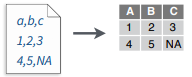</div>

<div class="grid-item">
**Semi-colon Delimited Files **
```{R eval=FALSE}
write_file(x = "a;b;c\n1;2;3\n4;5;NA", path = "file2.csv") 
read_csv2("file2.csv")
```
</div>
<div class="grid-item"><br>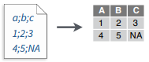</div>

<div class="grid-item">
**Files with Any Delimiter**
```{R eval=FALSE}
write_file(x = "a|b|c\n1|2|3\n4|5|NA", path = "file.txt") 
ead_delim("file.txt", delim = "|")
```
</div>
<div class="grid-item"><br>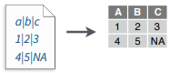</div>

<div class="grid-item">
**Fixed Width Files**
```{R eval=FALSE}
write_file(x = "a b c\n1 2 3\n4 5 NA", path = "file.fwf") 
read_fwf("file.fwf", col_positions = c(1, 3, 5))
```
</div>
<div class="grid-item"><br>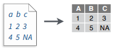</div>

<div class="grid-item">
**Tab Delimited Files**
```{R eval=FALSE}
write_file(x = "a\tb\tc\n1\t2\t3\n4\t5\tNA", path = "file.tsv")
read_tsv("file.tsv") Also read_table()
```
</div>

</div>


### Useful arguments

<div class="grid-container">

<div class="grid-item">
**Example File**
```{R eval=FALSE}
write_file("a,b,c\n1,2,3\n4,5,NA","file.csv")
f <- "file.csv" 
```
</div>
<div class="grid-item"><br>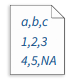</div>


<div class="grid-item">
**No header**
```{R eval=FALSE}
read_csv(f, col_names = FALSE)
```
</div>
<div class="grid-item"><br>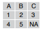</div>


<div class="grid-item">
**Provide header**
```{R eval=FALSE}
read_csv(f, col_names = c("x", "y", "z"))
```
</div>
<div class="grid-item"><br>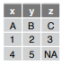</div>


<div class="grid-item">
**Skip lines**
```{R eval=FALSE}
read_csv(f, skip = 1) 
```
</div>
<div class="grid-item"><br>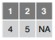</div>


<div class="grid-item">
**Read in a subset**
```{R eval=FALSE}
read_csv(f, n_max = 1) 
```
</div>
<div class="grid-item"><br>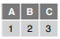</div>


<div class="grid-item">
**Missing Values**
```{R eval=FALSE}
read_csv(f, na = c("1", "."))
```
</div>
<div class="grid-item"><br>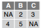</div>


</div>


### Read Non-Tabular Data

**Read a file into a single string**
```{R eval=FALSE}
read_file(file, locale = default_locale())
```

**Read each line into its own string**
```{R eval=FALSE}
read_lines(file, skip = 0, n_max = -1L, na = character(),
locale = default_locale(), progress = interactive())
```

**Read each line into its own string**
```{R eval=FALSE}
read_lines(file, skip = 0, n_max = -1L, na = character(),
locale = default_locale(), progress = interactive())
```

**Read a file into a raw vector**
```{R eval=FALSE}
read_file_raw(file)
```

**Read each line into a raw vector**
```{R eval=FALSE}
read_lines_raw(file, skip = 0, n_max = -1L,
progress = interactive())
```

**Read Apache style log files**
```{R eval=FALSE}
read_log(file, col_names = FALSE, col_types = NULL, skip = 0, n_max = -1, progress = interactive())
```

## Data Types

readr functions guess the types of each column and convert types when appropriate (but will NOT convert strings to factors automatically). A message shows the type of each column in the result.

```{r echo = FALSE, out.width = "50%"}
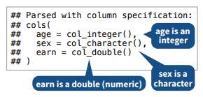
```

1. Use problems() to diagnose problems.
```{R eval=FALSE}
x <- read_csv("file.csv"); problems(x) 
```

2. Use a col_ function to guide parsing.

* col_guess() - the default
* col_character()
* col_double(), col_euro_double()
* col_datetime(format = "") 
  Also col_date(format = ""), col_time(format = "")
* col_factor(levels, ordered = FALSE)
* col_integer()
* col_logical()
* col_number(), col_numeric()
* col_skip()

```{R eval=FALSE}
x <- read_csv("file.csv", col_types = cols(
 A = col_double(),
 B = col_logical(),
 C = col_factor())) 
```

3. Else, read in as character vectors then parse with a parse_ function.

* parse_guess()
* parse_character()
* parse_datetime() 
  Also parse_date() and parse_time()
* parse_double()
* parse_factor()
* parse_integer()
* parse_logical()
* parse_number()

```{R eval=FALSE}
x$A <- parse_number(x$A)
```

### Tibbles

An enhanced data frame

The tibble package provides a new S3 class for storing tabular data, the
tibble. Tibbles inherit the data frame class, but improve three behaviors:

* Subsetting - [ always returns a new tibble, [[ and $ always return a vector.
* No partial matching - You must use full column names when subsetting
* Display - When you print a tibble, R provides a concise view of the
data that fits on one screen
```{r echo = FALSE, out.width = "80%"}
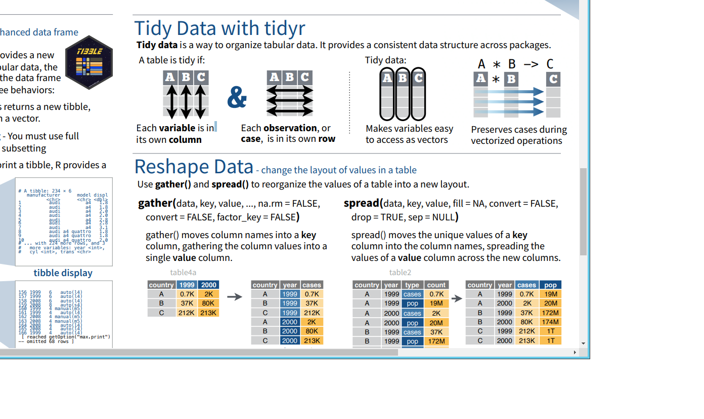
```
* Control the default appearance with options:
```{R eval=FALSE}
options(tibble.print_max = n,
tibble.print_min = m, tibble.width = Inf)
```

* View full data set with `View()` or `glimpse()`
* Revert to data frame with `as.data.frame()`

**CONSTRUCT A TIBBLE IN TWO WAYS**

* tibble(…) - Construct by columns.
```{R}
tibble(x = 1:3, y = c("a", "b", "c"))
```

* tribble(…) - Construct by rows.
```{R}
tribble( ~x, ~y,
 1, "a",
 2, "b",
 3, "c")
```


**Other functions**

* Convert data frame to tibble.
```
as_tibble(x, …)  
```
* Convert named vector to a tibble
```
enframe(x, name = "name", value = "value")
```
* Test whether x is a tibble.
```
is_tibble(x) 
```


## Tidy Data with tidyr

Tidy data is a way to organize tabular data. It provides a consistent data structure across packages.

* A table is tidy if:

<div class="grid-container">

<div class="grid-item">1. Each variable is in
its own column.</div>
<div class="grid-item">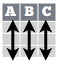</div>

<div class="grid-item">2. Each observation, or
case, is in its own row.</div>
<div class="grid-item"></div>

</div>


* Tidy Data:

<div class="grid-container">

<div class="grid-item">1. Makes variables easy
to access as vectors.</div>
<div class="grid-item"></div>

<div class="grid-item">2. Preserves cases during
vectorized operations.</div>
<div class="grid-item">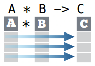</div>

</div>


## Reshape Data

change the layout of values in a table

* `gather()` moves column names into a key column, gathering the column values into a single value column.
 
```
gather(data, key, value, ..., na.rm = FALSE,
convert = FALSE, factor_key = FALSE)
```

<div class="grid-container_auto">

<div class="grid-item">
```
gather(table4a, `1999`, `2000`,
key = "year", value = "cases") 
```
</div>
<div class="grid-item">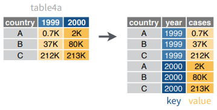</div>

</div>

* `spread()` moves the unique values of a key column into the column names, spreading the values of a value column across the new columns.


```
spread(data, key, value, fill = NA, convert = FALSE,
drop = TRUE, sep = NULL)
```


<div class="grid-container_auto">

<div class="grid-item">
```
spread(table2, type, count)
```
</div>
<div class="grid-item">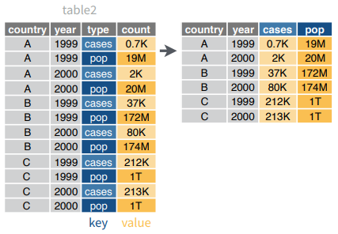</div>

</div>


## Handle Missing Values

* `drop_na(data, ...)`: Drop rows containing NA’s in … columns.

<div class="grid-container">

<div class="grid-item">
```
drop_na(x, x2)
```
</div>
<div class="grid-item">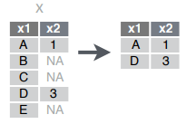</div>

</div>


* `fill(data, ..., .direction = c("down", "up"))`: Fill in NA’s in … columns with most recent non-NA values.

<div class="grid-container">
<div class="grid-item">
```
fill(x, x2)
```
</div>
<div class="grid-item">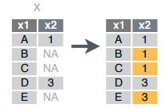</div>
</div>

* `replace_na(data,replace = list(), ...)`: Replace NA’s by column.


<div class="grid-container">
<div class="grid-item">
```
replace_na(x, list(x2 = 2))
```
</div>
<div class="grid-item">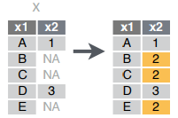</div>
</div>


## Expand Tables

quickly create tables with combinations of values


* `complete(data, ..., fill = list())`: 
  Adds to the data missing combinations of the values of the variables listed in …


<div class="grid-container">
<div class="grid-item">
```
complete(mtcars, cyl, gear, carb)
```
</div>
<div class="grid-item"></div>
</div>


* `expand(data, ...)`: 
  Create new tibble with all possible combinations of the values of the variables listed in …

<div class="grid-container">
<div class="grid-item">
```
expand(mtcars, cyl, gear, carb)
```
</div>
<div class="grid-item"></div>
</div>


## Split Cells

Use these functions to split or combine cells into individual, isolated values.

```
separate(data, col, into, sep = "[^[:alnum:]]+", remove = TRUE, convert = FALSE,
extra = "warn", fill = "warn", ...)
```
Separate each cell in a column to make several columns.

<div class="grid-container_auto">
<div class="grid-item">
```
separate(table3, rate, into = c("cases", "pop"))
```
</div>
<div class="grid-item">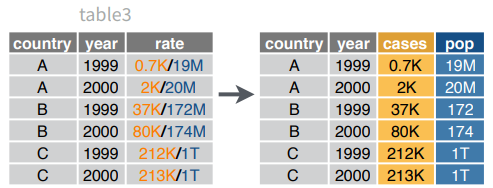</div>
</div>

```
separate_rows(data, ..., sep = "[^[:alnum:].]+", convert = FALSE)
```
Separate each cell in a column to make several rows. Also separate_rows_().

<div class="grid-container_auto">
<div class="grid-item">
```
separate_rows(table3, rate)
```
</div>
<div class="grid-item">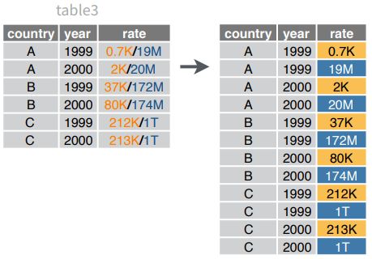</div>
</div>

```
unite(data, col, ..., sep = "_", remove = TRUE)
```
Collapse cells across several columns to make a single column.

<div class="grid-container_auto">
<div class="grid-item">

```
unite(table5, century, year, col = "year", sep = "")
```
</div>
<div class="grid-item">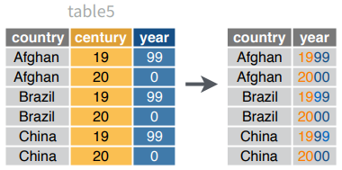</div>
</div>


## fread() for bigger datasets
- set working directory
- packages "data.table"
- handles large datasets fast
- easy to use
- improved .CSV importing features
    * separator is automatically recognised
    * strings are not automaticall convertied to factors | 'stringsAsFactors=T'
    * the header is displayed automaticall
- output: 'data.frame' (second class: 'data.frame') | 'data.table=F'


```{r}
library(data.table)
mydata = fread("./data/Bug-Frequency.csv")
mydata
```

[World population](https://en.wikipedia.org/wiki/World_population)


```{r}
df = fread("1	 Singapore	5,612,300	710	7,905
2	 Bangladesh	164,170,000	143,998	1,140
3	 Taiwan	23,562,318	36,190	651
4	 South Korea	51,446,201	99,538	517
5	 Lebanon	6,082,000	10,452	582
6	 Rwanda	11,809,295	26,338	448
7	 Netherlands	17,200,000	41,526	414
8	 Haiti	10,911,819	27,065	403
9	 India	1,329,250,000	3,287,240	404
10	 Israel	8,830,000	22,072	400",
col.names = c("Rank",	"Country","Population",	"Area(km2)","Density(Pop. per km2)"
))

df
```


## data.frame

- the mainly used object type
- straightforward sttucture
    * one row for each observation
    * one column for each variable
- R offers different data frame classes
    * similar to R's data visualization systems:
        - 'R-base'
        - 'lattice'
        -  'ggplot2'

## Three data frame alternatives
- 'data.frame()' function in 'R-base'
- 'data.table()' function in the package 'data.table'
- 'data_frame()' function in the package 'dplyr'

each of them is suitabl for storing most data - Let's see their specialities


### data.frame

- no external package needed
- straightforward for simple tasks
- strings are stored as factors per default
- data recycling
- row names can be provided

```{r}
mydf = data.frame(
    a = c("Paul", "Kim","Nora","Sue","Paul","Kim"),
    b = c("A", "B","C","B","B","C"),
    c = rnorm(2)
)
mydf

sapply(mydf, class)
```


### data.table

- quick and easy to code
- start processing time
- great documentation
- second class 'data.frame'
- 'data.table' struction is similar to SQL structure

    * 'nameDT [i, j, by]'
        - 'i' stands for the subset from our 'data.table' we want to work with
        - 'j' is the actual calculation that will be performed in the data subset 'i'
        - the whole calculation is grouped by 'by

- strings are not automatically transfromed to factors
- no custom row names, just row IDs
- if a dataset is too big to be processed, then only the first and last five rows are printed

```{r}
library(data.table)
mytable = data.frame(
    a = c("Paul", "Kim","Nora","Sue","Paul","Kim"),
    b = c("A", "B","C","B","B","C"),
    c = rnorm(2)
)
mytable

```

### data_frame

- requires equals column length
- only columns of length 1 will be recycled
- only the firs couple of rows are displayed in case of large datasets
- second class: 'data.frame'
- stirngs are not automatically transformed to factors
- no custom row names, just row IDs

```{r}
library(dplyr)
my_df = data.frame(
    a = c("Paul", "Kim","Nora","Sue","Paul","Kim"),
    b = c("A", "B","C","B","B","C"),
    c = rnorm(6)
)
my_df

```

### Summary

```{r}
class(mydf); class(mytable); class(my_df)
```

- it is benefically to use advanced tools for extended data management
- 'data.table' and 'data_frame' have the standard 'data.frame' as second class 


## tibble

### nycflights13

To explore the basic data manipulation verbs of dplyr, we'll use `nycflights13::flights`. This data frame contains all `r format(nrow(nycflights13::flights), big.mark = ",")` flights that departed from New York City in 2013. The data comes from the US [Bureau of Transportation Statistics](http://www.transtats.bts.gov/DatabaseInfo.asp?DB_ID=120&Link=0), and is documented in `?flights`.

```{r}
library(nycflights13)
flights
```


> You might notice that this data frame prints a little differently from other data frames you might have used in the past: it only shows the first few rows and all the columns that fit on one screen. (To see the whole dataset, you can run `View(flights)` which will open the dataset in the RStudio viewer). It prints differently because it's a __tibble__. Tibbles are data frames, but slightly tweaked to work better in the tidyverse. For now, you don't need to worry about the differences; we'll come back to tibbles in more detail in [wrangle](#wrangle-intro).
 
> You might also have noticed the row of three (or four) letter abbreviations under the column names. These describe the type of each variable:

> * `int` stands for integers.
> * `dbl` stands for doubles, or real numbers.
> * `chr` stands for character vectors, or strings.
> * `dttm` stands for date-times (a date + a time).
> * `lgl` stands for logical, vectors that contain only `TRUE` or `FALSE`.
> * `fctr` stands for factors, which R uses to represent categorical variables with fixed possible values.
> * `date` stands for dates.


## 'scan()' for small vectors and snippets 

```{r}
numbers = scan()
# characters = scan(what= "character")
```


## Other types of data

Try one of the following packages to import other types of files.

* haven : SPSS, Stata, and SAS files
* readxl : excel files (.xls and .xlsx)
* DBI : databases
* jsonlite : json
* xml2 : XML
* httr : Web APIs
* rvest : HTML(Web Scraping)

packages 'foreing'
to get help : ?foreign

?Hmisc


## Alternatives

There are two main alternatives to readr: base R and data.table's `fread()`. The most important differences are discussed below.

### Base R

Compared to the corresponding base functions, readr functions:

* Use a consistent naming scheme for the parameters (e.g. `col_names` and 
 `col_types` not `header` and `colClasses`).
 
* Are much faster (up to 10x).

* Leave strings as is by default, and automatically parse common 
  date/time formats.

* Have a helpful progress bar if loading is going to take a while.

* All functions work exactly the same way regardless of the current locale.
  To override the US-centric defaults, use `locale()`.

### data.table and `fread()`

[data.table](https://github.com/Rdatatable/data.table) has a function similar to `read_csv()` called fread. Compared to fread, readr functions:

* Are slower (currently ~1.2-2x slower. If you want absolutely the best 
  performance, use `data.table::fread()`.
  
* Use a slightly more sophisticated parser, recognising both 
  doubled (`""""`) and backslash escapes (`"\""`), and can produce
  factors and date/times directly.
  
* Forces you to supply all parameters, where `fread()` saves you work by
  automatically guessing the delimiter, whether or not the file has a
  header, and how many lines to skip.
  
* Are built on a different underlying infrastructure. Readr functions
  are designed to be quite general, which makes it easier to add 
  support for new rectangular data formats. `fread()` is designed to be 
  as fast as possible.
