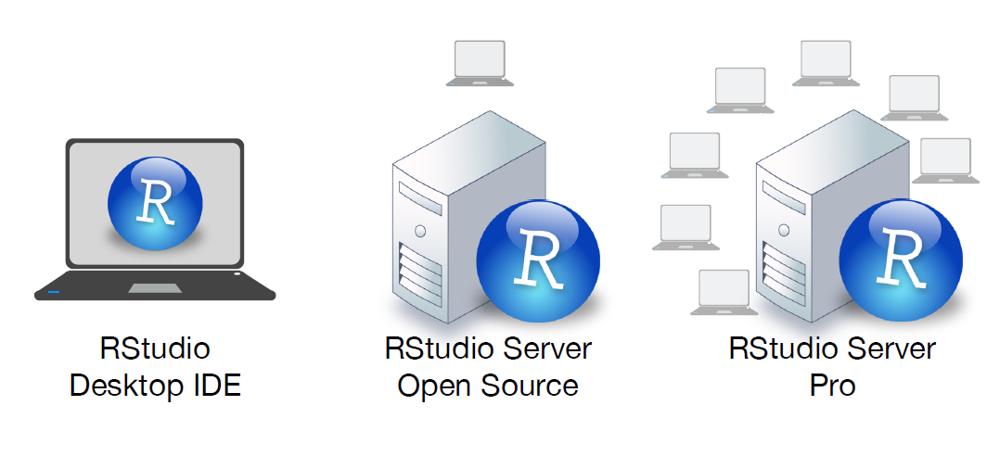

```{r, echo = FALSE}
knitr::opts_chunk$set(collapse = TRUE, comment = "#>")
```

<br>

## Rstudio IDE

```{r echo = FALSE, out.width = "75%"}
knitr::include_graphics("diagrams/rstudio-editor.png")
```

<br>

## Short Keys to remember

|short key            |의미  
|:--------------------|:-------------
|Ctrl + Enter         |한줄 실행
|Ctrl + Shift + S     |전체실행
|Ctrl + L             |clear console
|Alt + -              |insert "<-"
|Ctrl + Shift + M     |insert "%>%"
|Ctrl + Shift + C     |(un)comment lines


<br>

## RStudio IDEs

```{r echo = FALSE, out.width = "75%"}

```

<br>

## Reference

- [RStudio IDE Cheat Sheet](https://www.rstudio.com/resources/cheatsheets/#ide)


