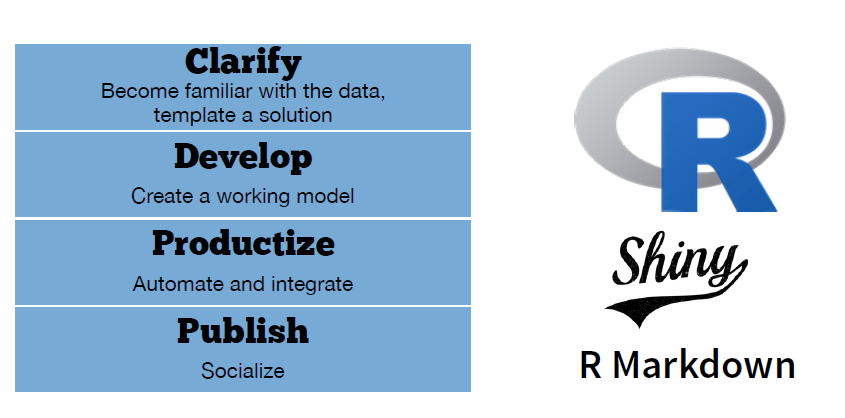
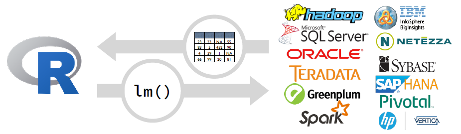
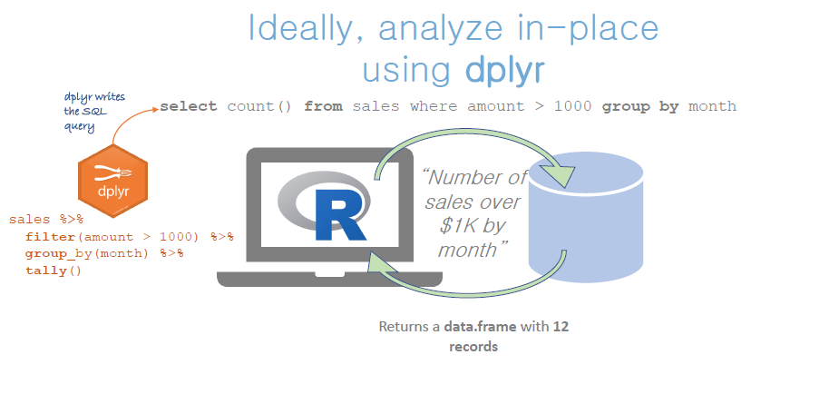

<br>

## Lifecycle of an Analysis Project


```{r echo = FALSE, out.width = "70%", fig.align='center'}

```


<br>

## Challenges

```{r echo = FALSE, out.width = "70%", fig.align='center'}
knitr::include_graphics("image/bk06_working-with-bigdata/challenge.png")
```

<br>

## Big Data

```{r echo = FALSE, out.width = "70%", fig.align='center'}
knitr::include_graphics("image/bk06_working-with-bigdata/bigdata.png")
```

<br>

## How do Analysts use big data?


#### Class 1. Extract Data


```{r echo = FALSE, out.width = "50%", fig.align='center'}
knitr::include_graphics("image/bk06_working-with-bigdata/extract.png")
```


#### Class 2. Compute on the parts


```{r echo = FALSE, out.width = "50%", fig.align='center'}

```

#### Class 3. Compute on the whole


```{r echo = FALSE, out.width = "50%", fig.align='center'}
knitr::include_graphics("image/bk06_working-with-bigdata/whole.png")
```

<br>

## General Strategy

1. Collect random sample of training data

2. Fit a model to the sample (in R)

3. Score against test data (in DB)


```{r echo = FALSE, out.width = "80%", fig.align='center'}


```

<br>

## dplyr

Package that provides data manipulation syntax for R. Comes with built-in SQL backend:

1. Connects to DBMS’s

2. Transforms R code to SQL, sends to DBMS to run in DBMS

3. Collect results into R

```{r echo = FALSE, out.width = "100%", fig.align='center'}


```


<br>

## Analytic Environments


```{r echo = FALSE, out.width = "80%", fig.align='center'}
knitr::include_graphics("image/bk06_working-with-bigdata/environment.png")

```

<br>

## 빅데이터 대응전략

1. 분석목적에 맞는 형태의 데이터로 사전에 가공하여 분석마트를 생성
	
	-  데이터 규모 축소

	-  다수의 작은 데이터를 합쳐서 처리해야할 파일수를 줄이기

	-  비정형데이터를 정형데이터로 변환(XML -> CSV) 

2 High Performance 기술 활용

  - 전체 데이터를 독립적인 단위로 나누어 분산처리

  - 병렬처리 기술 활용

3. database 등 빅데이터 기술 활용 

	- easy way : RSQLite, MonetDB

	- hard way: 스파크, 하둡 클러스터, GPU 등 빅데이터 기술 활용

<br>
  
## 결론 

- 다수 기관들의 빅데이터 사업이 실제로는 복잡한 빅데이터 기술을 적용하지 않고 분석 가능한 사례가 많음 

- 개인연구 또는 소규모 프로젝트에는 easy way를 적극 활용할 필수

<br>

## 데이터 유형별 대응전략 권고


처리속도     | 메모리 이내(50%, 1~4G) | 10~100 Giga   | tera 급
-------------|------------------------|---------------|---------------------
배치, 분석   | dplyr                  | DB(RSQLite)   | Sparklyr with Hadoop Cluster
near 실시간  | Parallel, DT, feather  | Monetdb       | Empala 등 ...


<br>

## 본 과정의 분석사례


1. 부동산 실거래 데이터

	- 비정형 -> 정형화

	- 다수의 작은 파일 -> 하나의 파일로 합치기

	- 데이터 구조 변화

	- parallel computation


2. Flight 데이터

	- 분석마트 생성

	- 데이터 구조 변화
	
	- data.table, feather
	
	- RSQLite, MonetDB


3. 한국거래소 상장주식 주가 크롤링

  


