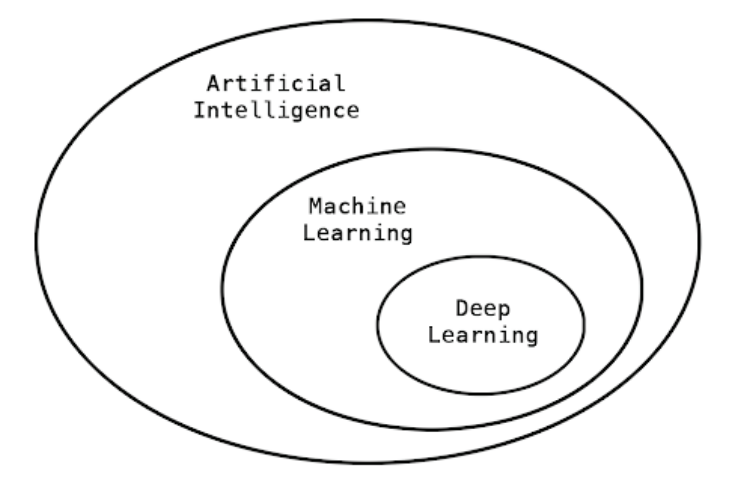
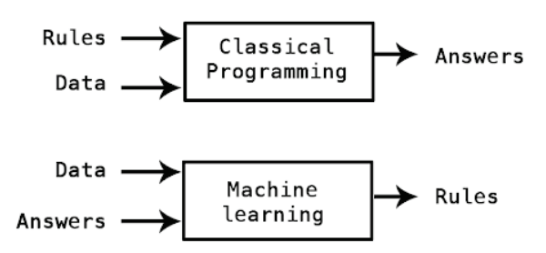
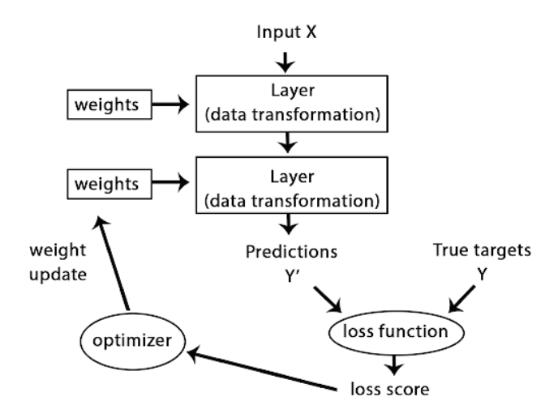
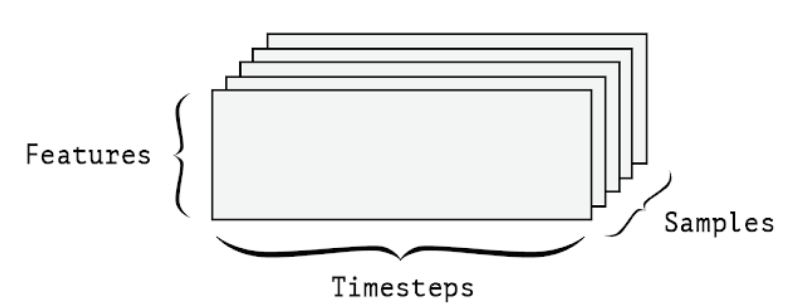
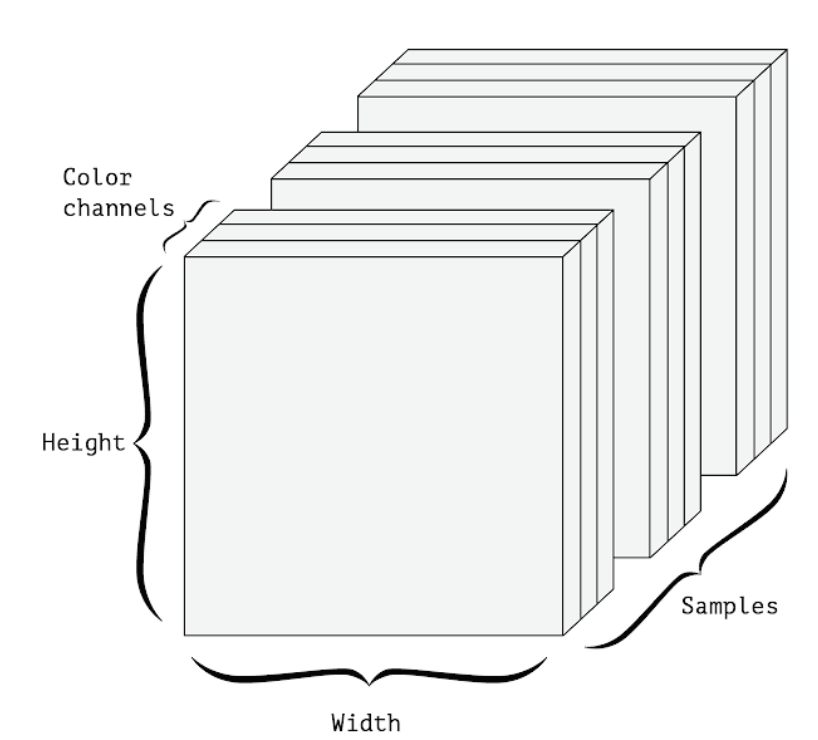

<br>

## Artifical Intelligence


Artificial intelligence was born in the 1950s

**Symbolic AI from 1950s to 1980s**

human-level artificial intelligence could be achieved by having programmers handcraft a sufficiently large set of explicit rules for manipulating knowledge. 

It reached its peak popularity during the expert systems boom of the 1980s.

<br>

**Machine Learning**

```{r echo=FALSE, fig.cap="AI, ML, Deep Learning", out.width = '70%'}

```

<br>

## Machine Learning :  a new programming paradigm

```{r echo=FALSE, out.width = '70%'}

```

<br>

##  Deep representations learned by a digit-classification model

```{r echo=FALSE, out.width = '100%'}
knitr::include_graphics("./diagrams/dl_process.png")
```

<br>

##  A neural network is parametrized by its weights

```{r echo=FALSE, out.width = '70%'}

```

<br>

## A 3D timeseries data tensor

Whenever time matters in your data (or the notion of sequence order), it makes sense to
store it in a 3D tensor with an explicit time axis. Each sample can be encoded as a
sequence of vectors (a 2D tensor), and thus a batch of data will be encoded as a 3D tensor
(see figure 2.3)


The time axis is always the second axis, by convention. Let’s have a look at a few
examples:
A dataset of stock prices. Every minute, we store the current price of the stock, the
highest price in the past minute, and the lowest price in the past minute. Thus every
minute is encoded as a 3D vector, an entire day of trading is encoded as a 2D tensor of
shape (there are 390 minutes in a trading day), and 250 days worth of data can (390, 3)
be stored in a 3D tensor of shape (250, 390, 3). Here, each sample would be one day’s
worth of data.
A dataset of tweets, where we encode each tweet as a sequence of 140 characters out of
an alphabet of 128 unique characters. In this setting, each character can be encoded as a
binary vector of size 128 (an all-zeros vector except for a 1 entry at the index
corresponding to the character). Then each tweet can be encoded as a 2D tensor of shape
(140, 128), and a dataset of 1 million tweets can be stored in a tensor of shape
(1000000, 140, 128).

```{r echo=FALSE, out.width = '70%'}

```

<br>

##  A 4D image data tensor (channels-first convention)

Image data

Images typically have three dimensions: height, width, and color depth. Although
grayscale images (like our MNIST digits) have only a single color channel and could thus
be stored in 2D tensors, by convention image tensors are always 3D, with a
one-dimensional color channel for grayscale images. A batch of 128 grayscale images of
size 256 × 256 could thus be stored in a tensor of shape , and a (128, 256, 256, 1)
batch of 128 color images could be stored in a tensor of shape (128, 256, 256, 3)
(see figure 2.4).


There are two conventions for shapes of images tensors: the channels-last convention
(used by TensorFlow) and the channels-first convention (used by Theano). The
TensorFlow machine-learning framework, from Google, places the color-depth axis at
the end, as you just saw: (samples, height, width, color_depth). Meanwhile,
Theano places the color depth axis right after the batch axis: (samples, color_depth,
height, width). With the Theano convention, the previous examples would become
(128, 1, 256, 256) (128, 3, 256, 256) and . The Keras framework provides
support for both formats.

Video data

Video data is one of the few types of real-world data for which you’ll need 5D tensors. A
video can be understood as a sequence of frames, each frame being a color image.
Because each frame can be stored in a 3D tensor , a (height, width, color_depth)
sequence of frames can be stored in 4D tensor (frames, height, width,
color_depth), and thus a batch of different videos can be stored in a 5D tensor of shape
(samples, frames, height, width, color_depth).
For instance, a 60-second, 256 × 144 YouTube video clip sampled at 4 frames per
second would have 240 frames. A batch of four such video clips would be stored in a
tensor of shape . That’s a total of 106,168,320 values! If the (4, 240, 256, 144, 3)
data type of the tensor is double, then each value is stored in , so the tensor 64 bits
would represent 810 MB. Heavy! Videos you encounter in real life are much lighter,
because they aren’t stored in and they’re typically compressed by a large factor float32
(such as in the MPEG format)
```{r echo=FALSE, out.width = '70%'}

```

<br>

## Uncrumpling a complicated manifold of data

```{r echo=FALSE, out.width = '70%'}
knitr::include_graphics("./diagrams/Uncrumpling.png")
```


