exclude: true

```{r, message=FALSE, warning=FALSE, include=FALSE}
options(
  htmltools.dir.version = FALSE, # for blogdown
  width=80
)

# library(emo)
htmltools::tagList(rmarkdown::html_dependency_font_awesome())
```
---

## dplyr provides built-in SQL backend

1. Connects to DBMS’s

2. Transforms R code to SQL, sends to DBMS to run in DBMS

3. Collect results into R

```{r echo = FALSE, out.width = "100%", fig.align='center'}
knitr::include_graphics("image/bk06_working-with-bigdata/using_dplyr.png")

```

---

## DB Connection

```{r echo = FALSE, out.width = "100%", fig.align='center'}
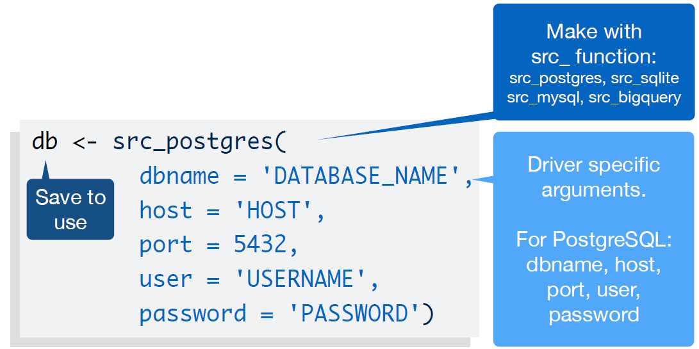

```
---

## Dplyr driver functions


```{r echo = FALSE, out.width = "100%", fig.align='center'}
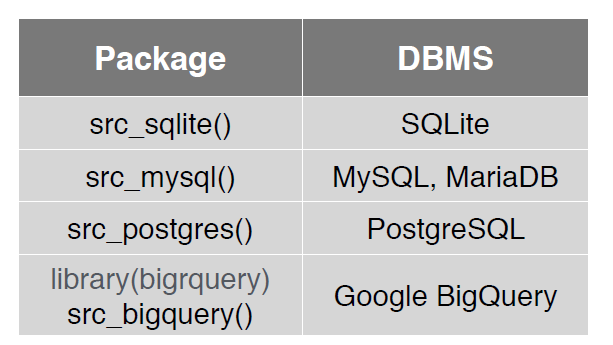

```


---

## dplyr command to SQL


```{r echo = FALSE, out.width = "100%", fig.align='center'}
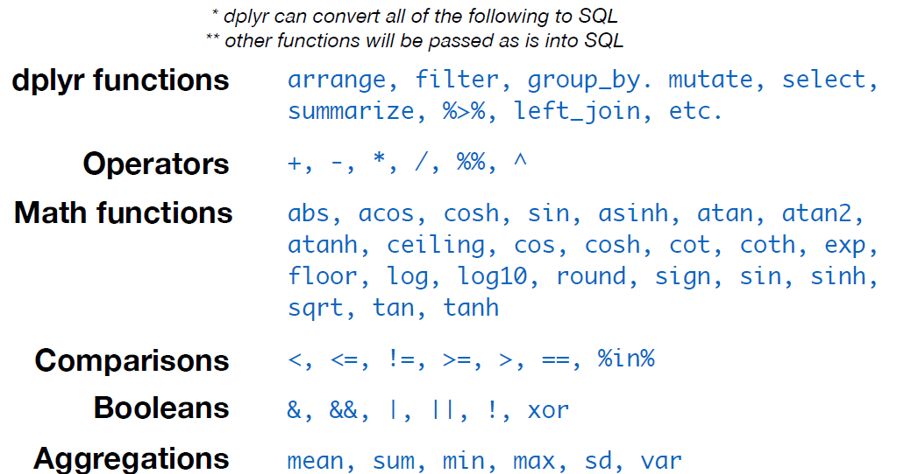

```

---
## Lazy Execution 

dplyr will only retrieve the first 10 rows of a query when you look at the output.


```{r echo = FALSE, out.width = "100%", fig.align='center'}
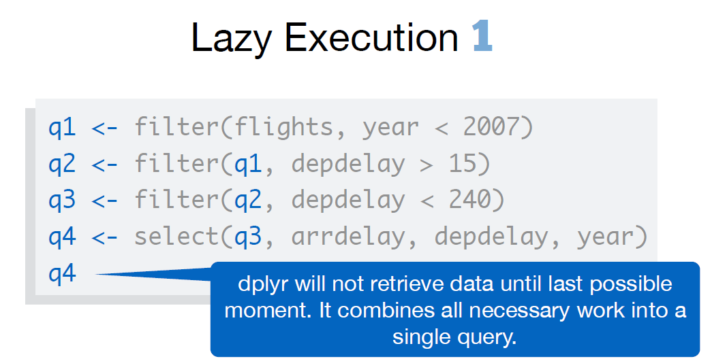

```

---
## Collect


```{r echo = FALSE, out.width = "100%", fig.align='center'}
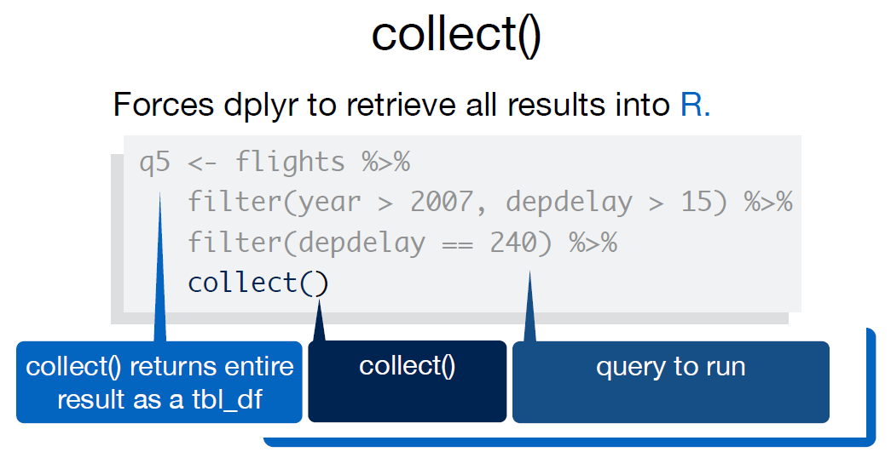

```

---

## collapse


```{r echo = FALSE, out.width = "100%", fig.align='center'}
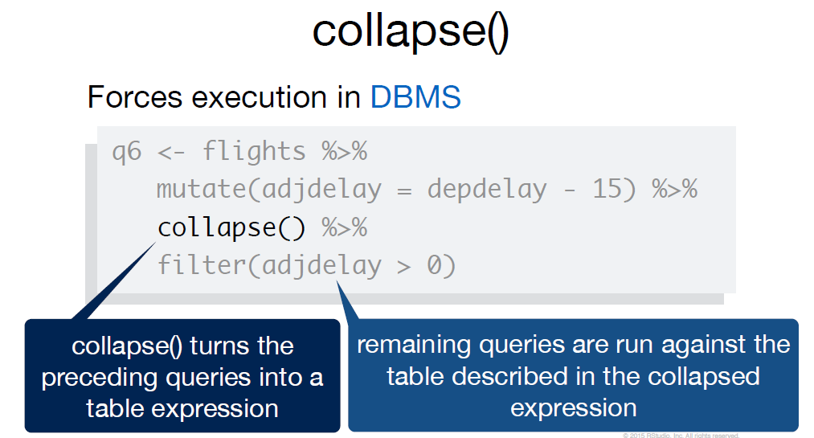

```

---

## Fit model


```{r echo = FALSE, out.width = "100%", fig.align='center'}
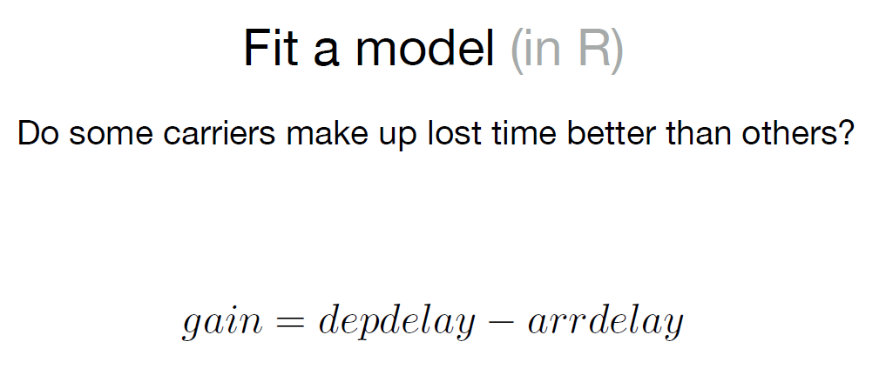

```

---

## copy to


```{r echo = FALSE, out.width = "100%", fig.align='center'}
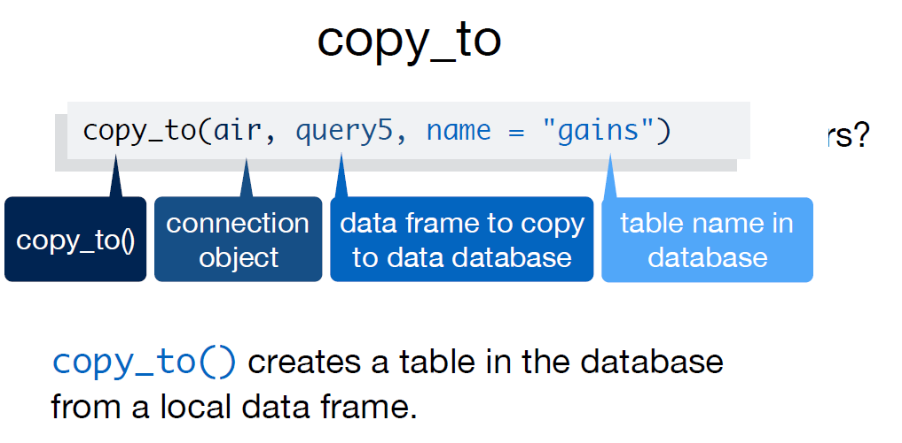

```

---
## close


```{r echo = FALSE, out.width = "100%", fig.align='center'}
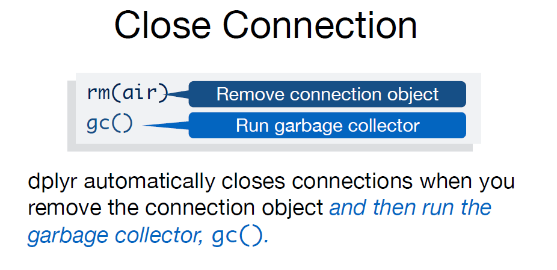

```
---
## alternative 


```{r echo = FALSE, out.width = "100%", fig.align='center'}
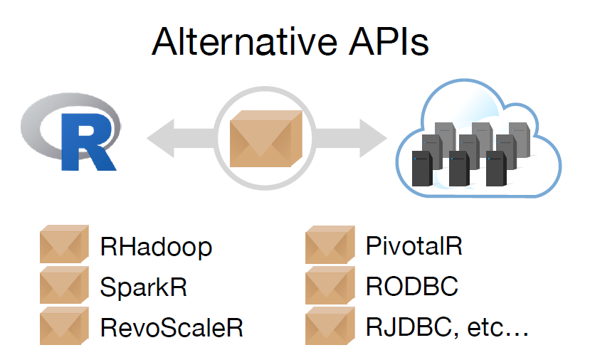

```

---

##  


```{r echo = FALSE, out.width = "100%", fig.align='center'}
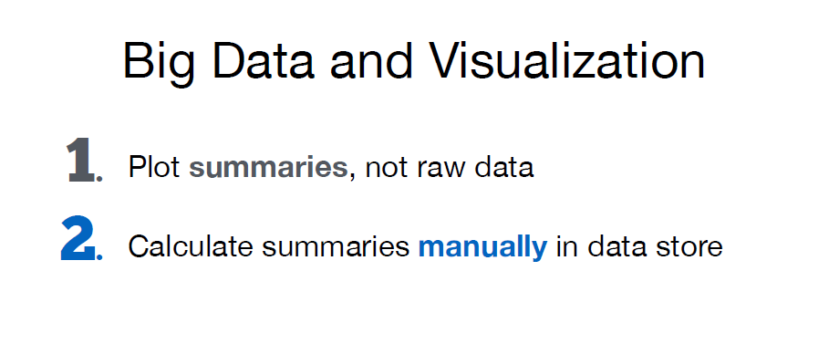

```
