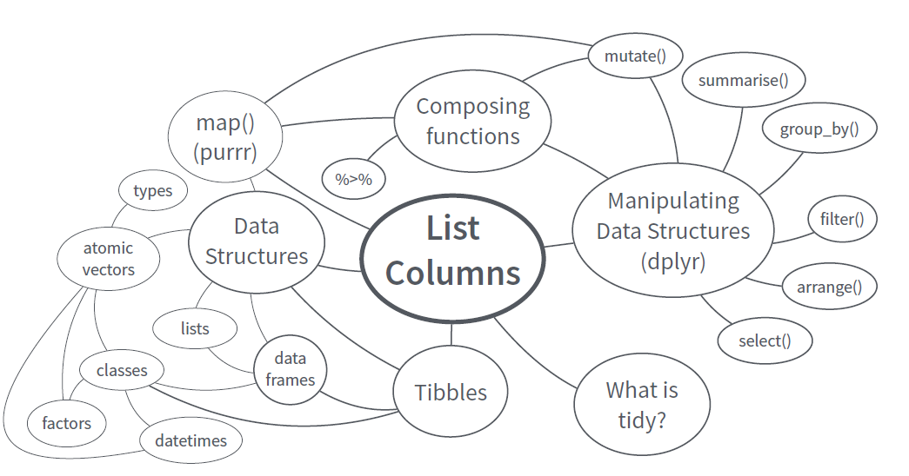

<br>

## 목적

- Data Science에 관심이 있는 연구자와 R 개발자를 위한 사이트로 [R Markdown](http://rmarkdown.rstudio.com/rmarkdown_websites.html)으로 구현

-  [RStudio사](https://www.rstudio.com)를 중심으로 발전하고 있는 다양한 최신 R 기술과  [Tidyverse](https://www.tidyverse.org)와 tibble List Column 등 새로운 프로그래밍 방식 등 R 프로그래밍을 활용한 대용량 데이터의 Best Practice 소개 

- R을 통계분석툴 뿐 아니라 다양한 데이터 관련 애플리케이션(리포팅, 인터렉티브한 대시보드, PDF, PPT, Blog, book 등의 다양한 시각화 자료)의 개발툴로 사용하는 툴인 R Markdown과 [Shiny](https://shiny.rstudio.com/)을 소개 

-  궁극적으로 [Reproducible Research](https://www.coursera.org/learn/reproducible-research)를 구현하는 Best Practice를 발굴

- 이를 위해 RStudio사가 제공하는 R package Cheat Sheet과 각종 자료를 활용 

<br>

## 과정 구성

<br>

  * Introduction (2 hour ***)  

    - Data Science and Big data Analysis (20 minutes)
    
    - Git and Github in RStudio for version control and Collaboration (10 minute)
    
    - Base R (1 hour)

<br>

  * Data Visualization with ggplot2 (30 minutes)

<br>

  * Data Wrangling in the Tydiverse way (2 hours ***)

    - Data Structure & Tidy Data (10 minute)
    
    - Data Wrangling with R (1.5 hour)

    
<br>

  * Data Analysis with Tibble & list column  (2 hours)
    
    - Function
    
    - Apply functions with `purrr`

    - Nest data & List Column
    

<br>

  * File handling (30 minutes ***)
  
  	- Data import with readr
    - file & directory

<br>
    
  * Getting data on the web (30 minutes)

    - Intro to Restful API (Exercise with Euro stat data)
    - CSV, XML, JSON


<br>

  * Exercise (2.5 hour)

    - 국토교통부 아파트 실거래가 데이터 (2 hour ***)
    
    - 네이버 주가정보 크롤링(1 hour) 

<br>

  * High Performance R programming (1.5 hour ***)

    - Parallelization with `foreach`, `parallel`, `multidplyr`

  	- data.table Package
  	
    - Fast On-Disk Format for Data Frames, `feather`
    
    - Rdata

<br>

  * BIG data Analysis (2.5 hour ***)
    
    - Big data Stratege (20 minutes)

    - Working with Big Data in R (1 hour)

    - Using Database with `RSQLite` and `MonetDB`

    - Exercise with Flight Dataset (1 hour) 

<br>

  * General-purpose Distributed Cluster-computing framework (20 minutes)
  
    - `Spark`, with `sparklyr`

    - Machine Learning with `H2o`
   
   
<br> 

  * R applications (3 hours)

    - Reproducible Research with `R markdown` (between each topic)

    - Interactive web with `Shiny` (1.5 hours)

	
<br> 

  * Text mining (3 hours)


<br> 

## 핵심 내용

```{r echo = FALSE, out.width = "100%", fig.align='center'}

```


<br>
  
## Reference

  * [R for Data Science - Grolemund, Wickham - O'Reilly, 2016](http://r4ds.had.co.nz/)

  * [Advanced R - Wickham - Chapman and Hall/CRC, 2014](http://adv-r.had.co.nz/)

  * [R Packages - Wickham - O'Reilly, 2015](http://r-pkgs.had.co.nz/)

  * [Stat545.com](http://stat545.com/)

<br>

## Software

  * R / RStudio

  * git & github
  
<br>

## Contact Information

  * `dookyung.kim74@gmail.com`

<br>

## Developing Tool of this site

  * This site is developed with RStudio IDE using Rmarkdown. 


    
    
