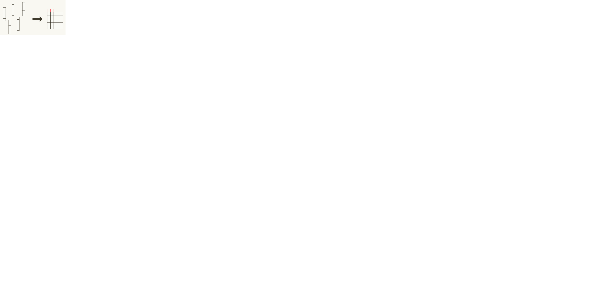
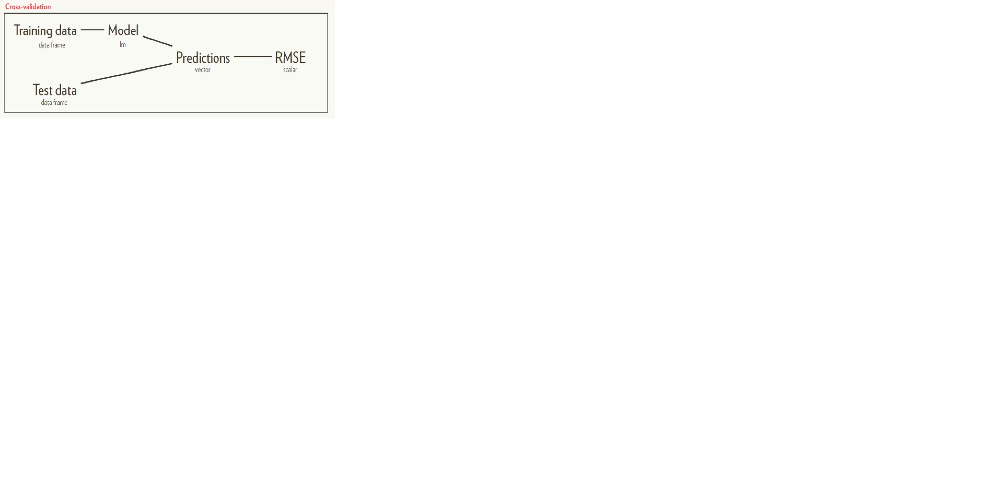

# Introduction to Tidy Data and `Tidyverse` 

R packages for data science

The tidyverse is an opinionated collection of R packages designed for data science. All packages share an underlying design philosophy, grammar, and data structures. 


```{r echo = FALSE, out.width = "100%"}
knitr::include_graphics("diagrams/Tidyverse_packages.png")
```


Installing tidyverse installs everything

```
install.packages("tidyverse")

# Instead of
install.packages(c(
 "broom", "dplyr", "feather",
 "forcats","ggplot2", "haven",
 "httr", "hms", "jsonlite",
 "lubridate", "magrittr",
 "modelr", "purrr", "readr",
 "readxl", "stringr", "tibble",
 "rvest", "tidyr", "xml2"
))
```

Loading it loads the core tidyverse

```
library(tidyverse)
# Instead of:
library(ggplot2)
library(tibble)
library(tidyr)
library(readr)
library(purrr)
library(dplyr)
# These are the packages you use in almost
# every analysis
```

Learn the tidyverse

R for data science
The best place to start learning the tidyverse is R for Data Science (R4DS for short), an O’Reilly book written by Hadley Wickham and Garrett Grolemund. It’s designed to take you from knowing nothing about R or the tidyverse to having all the basic tools of data science at your fingertips. You can read it online for free, or buy a physical copy.

We highly recommend pairing R4DS with the RStudio cheatsheets. These cheatsheets have been carefully designed to pack a lot of information into a small amount of space. You can keep them handy at your desk and quickly jog your memory when you get stuck. Most of the cheatsheets have been translated into multiple languages.


Goal: Solve complex
problems by combining
simple, uniform pieces.


Consistent
functions

The tidyverse separates commands and queries

A command function performs an action
A query function computes a value

```
# Command
print()
plot()
write_csv()
<-
# Query
summarise()
mutate()
+ geom_line()

```

Query functions are like legos
(As long as you pick a consistent data structure)

Command functions are like playmobil


**The pipe**

We already have ways to combine functions
```
by_dest <- group_by(flights, dest)
dest_delay <- summarise(by_dest,
 delay = mean(dep_delay, na.rm = TRUE),
 n = n()
)
big_dest <- filter(dest_delay, n > 100)
arrange(big_dest, desc(delay))
```

But naming is hard work

```
foo <- group_by(flights, dest)
foo <- summarise(foo,
 delay = mean(dep_delay, na.rm = TRUE),
 n = n()
)
foo <- filter(foo, n > 100)
arrange(foo, desc(delay))
```

```
foo1 <- group_by(flights, dest)
foo2 <- summarise(foo1,
 delay = mean(dep_delay, na.rm = TRUE),
 n = n()
)
foo3 <- filter(foo2, n > 100)
arrange(foo3, desc(delay))
```

You could nest function calls
```
arrange(
 filter(
 summarise(
 group_by(flights, dest),
 delay = mean(dep_delay, na.rm = TRUE),
 n = n()
 ),
 n > 100
 ),
 desc(delay)
)
```

magrittr::
%>%

This is easy to read & doesn’t require naming

```
flights %>%
 group_by(dest) %>%
 summarise(
 delay = mean(dep_delay, na.rm = TRUE),
 n = n()
 ) %>%
 filter(n > 100) %>%
 arrange(desc(delay))
```
ggplot2 was written before the pipe

```
flights %>%
 group_by(date) %>%
 summarise(n = n()) %>%
 ggplot(aes(date, n)) +
 geom_line() 
```


And is inconsistent
```
ggsave(
 flights %>%
 group_by(date) %>%
 summarise(n = n()) %>%
 ggplot(aes(date, n)) +
 geom_line(),
 "my-plot.pdf"
)
```

The command-query distinction is useful for pipes

The body is made up of queries
Every pipe is ended by a command


Where is the command function?

```
flights %>%
 group_by(dest) %>%
 summarise(
 delay = mean(dep_delay, na.rm = TRUE),
 n = n()
 ) %>%
 filter(n > 100) %>%
 arrange(desc(delay))
```

In the absence of a command, R prints

```
flights %>%
 group_by(dest) %>%
 summarise(
 delay = mean(dep_delay, na.rm = TRUE),
 n = n()
 ) %>%
 filter(n > 100) %>%
 arrange(desc(delay)) %>%
 print()
```

Another common command is assign
```
flights %>%
 group_by(dest) %>%
 summarise(
 delay = mean(dep_delay, na.rm = TRUE),
 n = n()
 ) %>%
 filter(n > 100) %>%
 arrange(desc(delay)) ->
 dest_delays
```


But leading with assignment improves readability

```
dest_delays <- flights %>%
 group_by(dest) %>%
 summarise(
 delay = mean(dep_delay, na.rm = TRUE),
 n = n()
 ) %>%
 filter(n > 100) %>%
 arrange(desc(delay))

```

Functions fit best into a pipe when:
 
1. The first argument is the “data”
2. The data is the same type across a
family of functions
 
 
**Tidy data**

Tidy data is a consistent way of storing data
1. Each dataset goes
in a data frame.
2. Each variable goes
in a column.


Messy data has a varied shape

```
# A tibble: 5,769 × 22
 iso2 year m04 m514 m014 m1524 m2534 m3544 m4554 m5564 m65 mu f04 f514 f014 f1524
 <chr> <int> <int> <int> <int> <int> <int> <int> <int> <int> <int> <int> <int> <int> <int> <int>
1 AD 1989 NA NA NA NA NA NA NA NA NA NA NA NA NA NA
2 AD 1990 NA NA NA NA NA NA NA NA NA NA NA NA NA NA
13 AD 2002 NA NA 0 0 0 1 0 0 0 NA NA NA 0 1
14 AD 2003 NA NA 0 0 0 1 2 0 0 NA NA NA 0 1
15 AD 2004 NA NA 0 0 0 1 1 0 0 NA NA NA 0 0
16 AD 2005 0 0 0 0 1 1 0 0 0 0 0 0 0 1
17 AD 2006 0 0 0 1 1 2 0 1 1 0 0 0 0 0
# ... with 5,752 more rows, and 6 more variables: f2534 <int>, f3544 <int>, f4554 <int>,
# f5564 <int>, f65 <int>, fu <int> 
```

Tidy data has a uniform shape

```
# A tibble: 35,750 × 5
 country year sex age n
 <chr> <int> <chr> <chr> <int>
1 AD 1996 f 014 0
2 AD 1996 f 1524 1
7 AD 1996 f 65 0
8 AD 1996 m 014 0
9 AD 1996 m 1524 0
10 AD 1996 m 2534 0
# ... with 35,740 more rows```
```

list-cols
Tidy tibbles are better than tidy data frames
1. Each dataset goes
in a tibble.
2. Each variable goes
in a column.


Tibbles are data frames that are lazy & surly

```
df <- tibble(xyz = "a")
df$x
#> Warning: Unknown column 'x'
#> NULL
df$xyz
#> [1] "a"
```

But also have better support for list-cols

```
data.frame(x = list(1:2, 3:5))
#> Error: arguments imply differing number
#> of rows: 2, 3
tibble(x = list(1:2, 3:5))
#> # A tibble: 2 x 1
#> x
#> <list>
#> 1 <int [2]>
#> 2 <int [3]>
```

List-columns keep related things together


```{r echo = FALSE, out.width = "100%"}

```
Anything can go in a list & a list can go in a data frame

sf (successor to sp) uses list-cols

```
nc <- sf::st_read(system.file("shape/nc.shp", package = "sf"))
nc %>%
 as_tibble() %>%
 select(NAME, FIPS, AREA, geometry)
#> # A tibble: 100 × 4
#> NAME FIPS AREA geometry
#> <fctr> <fctr> <dbl> <simple_feature>
#> 1 Ashe 37009 0.114 <MULTIPOLYGON...>
#> 2 Alleghany 37005 0.061 <MULTIPOLYGON...>
#> 3 Surry 37171 0.143 <MULTIPOLYGON...>
#> 4 Currituck 37053 0.070 <MULTIPOLYGON...>
#> 5 Northampton 37131 0.153 <MULTIPOLYGON...>
#> 6 Hertford 37091 0.097 <MULTIPOLYGON...>
#> 7 Camden 37029 0.062 <MULTIPOLYGON...>
#> 8 Gates 37073 0.091 <MULTIPOLYGON...>
#> 9 Warren 37185 0.118 <MULTIPOLYGON...>
#> 10 Stokes 37169 0.124 <MULTIPOLYGON...>
#> # ... with 90 more rows
```

```
nc %>%
 ggplot(aes(geometry = geometry, fill = AREA)) +
 geom_sf() +
 coord_sf(crs = sf::st_crs(nc))
```


list-cols are a beautiful fit to cross-validation


```{r echo = FALSE, out.width = "100%"}

```


Each resample becomes one row
```
# A tibble: 100 x 5
 train test .id mod rmse
 <list> <list> <chr> <list> <dbl>
1 <S3: resample> <S3: resample> 001 <S3: lm> 0.5661605
2 <S3: resample> <S3: resample> 002 <S3: lm> 0.2399357
3 <S3: resample> <S3: resample> 003 <S3: lm> 3.5482986
4 <S3: resample> <S3: resample> 004 <S3: lm> 0.2396810
5 <S3: resample> <S3: resample> 005 <S3: lm> 0.1591336
... with 90 more rows
````

**Conclusion**
Four important facts:
1. It exists
2. It has a website
3. It has a package
4. It has a book


Four underlying principles:
1. Each function encapsulates one task
2. And is either a query or a command
3. Functions are composed with %>%
4. And use tidy tibbles as primary data
structure


## Exercise

**Data Tidying**
“Tidy datasets are all alike but every messy dataset is messy in its own way.” – Hadley Wickham

Data science, at its heart, is a computer programming exercise. Data scientists use computers to store, transform, visualize, and model their data. As a result, every data science project begins with the same task: you must prepare your data to use it with a computer. In the wild, data sets come in many different formats, but each computer program expects your data to be organized in a predetermined way, which may vary from program to program.

In this chapter, you will learn the best way to organize your data for R, a task that I call data tidying. This may seem like an odd place to start, but tidying data is the most fruitful skill you can learn as a data scientist. It will save you hours of time and make your data much easier to visualize, manipulate, and model with R.

Note that this chapter explains how to change the format, or layout, of tabular data. To learn how to use different file formats with R, see Appendix B: Data Sources.


**Outline**
In Section 2.1, you will learn how the features of R determine the best way to layout your data. This section introduces “tidy data,” a way to organize your data that works particularly well with R.

Section 2.2 teaches the basic method for making untidy data tidy. In this section, you will learn how to reorganize the values in your data set with the the spread() and gather() functions of the tidyr package.

Section 2.3 explains how to split apart and combine values in your data set to make them easier to access with R.

Section 2.4 concludes the chapter, combining everything you’ve learned about tidyr to tidy a real data set on tuberculosis epidemiology collected by the World Health Organization.


계속
http://garrettgman.github.io/tidying/
