## tidyr & dplyr

Two packages to help you work with the structure of data.

```{r}
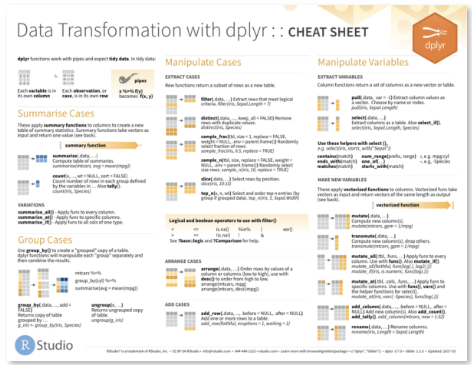
```
https://www.rstudio.com/resources/cheatsheets/

---
```{r}
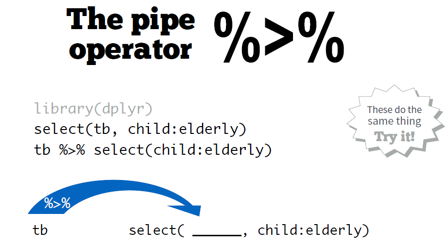
```


--- 

Data sets come in many formats
…but R prefers just one.


---
## pipe

```{r}

```

---
## tidy data

```{r}
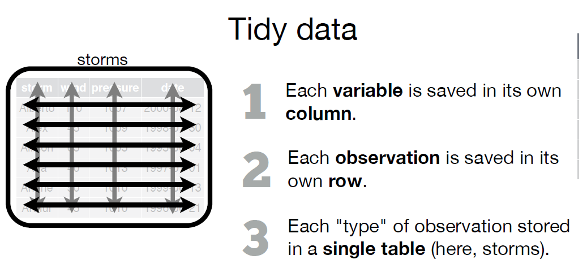
```

### Examples:


```{r}
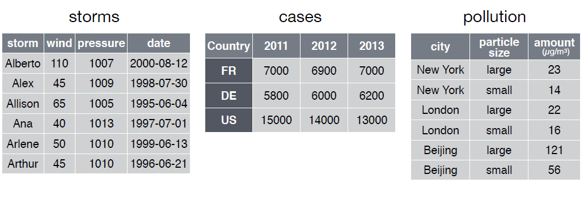
```

---
## tidyr

A package that reshapes the layout of
tables.

Two main functions: gather() and spread()


### test
```{r}
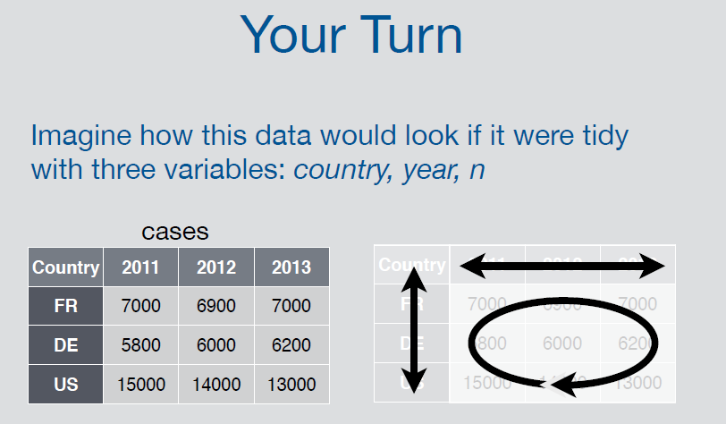
```


--- 

## gather

```{r}
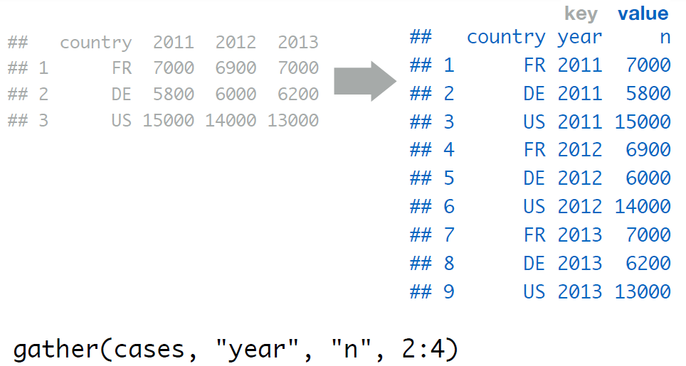
```
---

## gather

```{r}
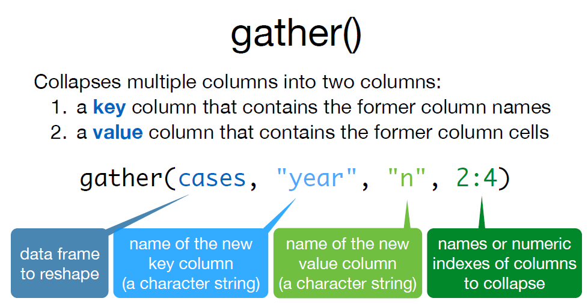
```


---

## test2

```{r}
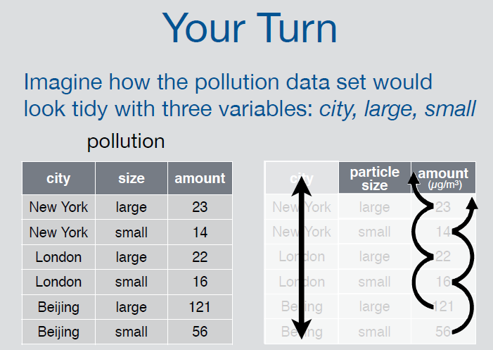
```


---

## spread

```{r}
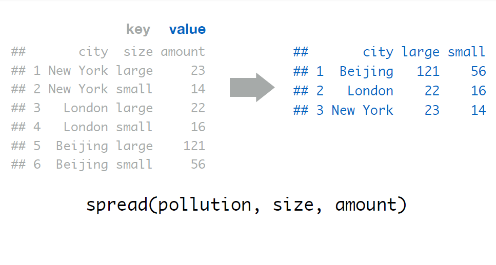
```
---

## spread

```{r}
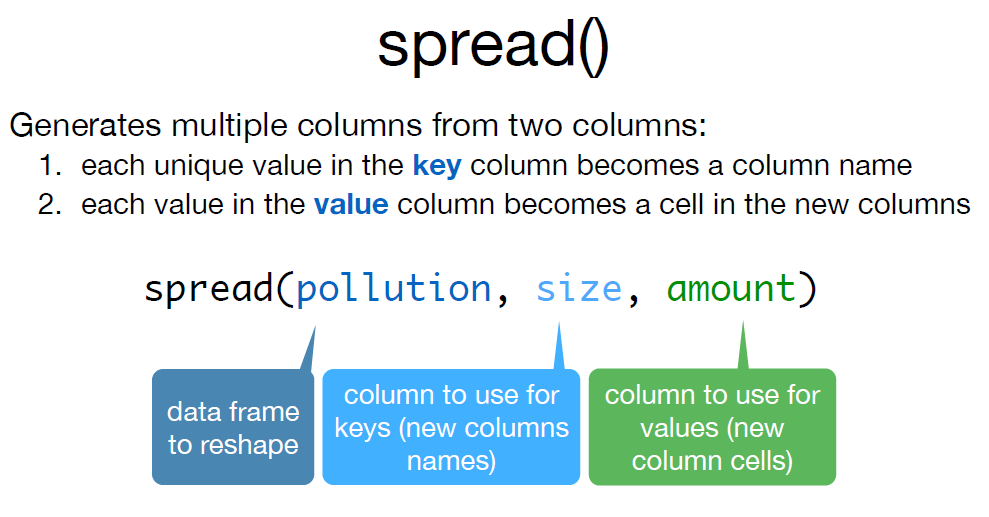
```

---

## gther & spread

```{r}
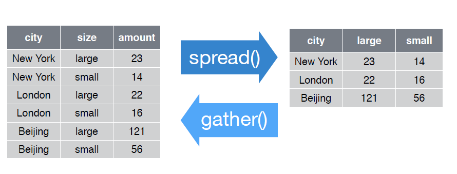
```

---

## separate

```{r}
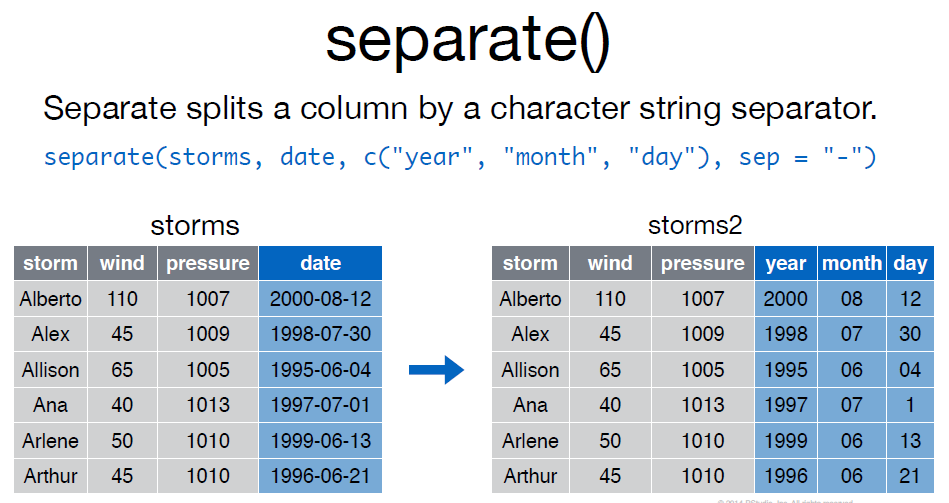
```


---

## unite

```{r}
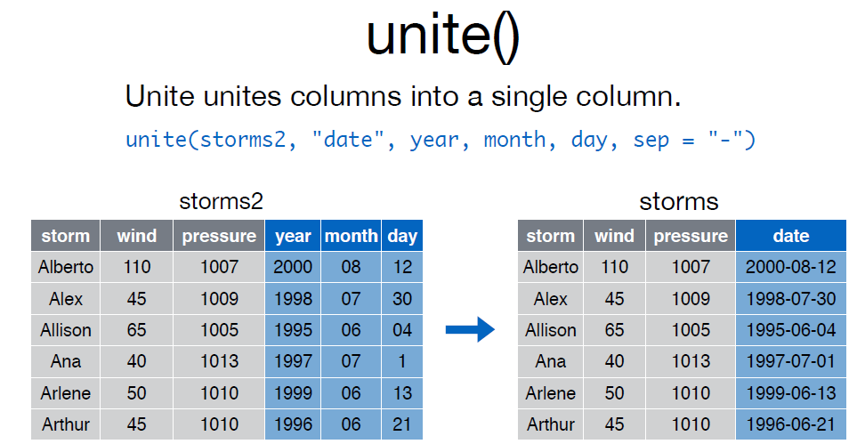
```


---

## recap

```{r}
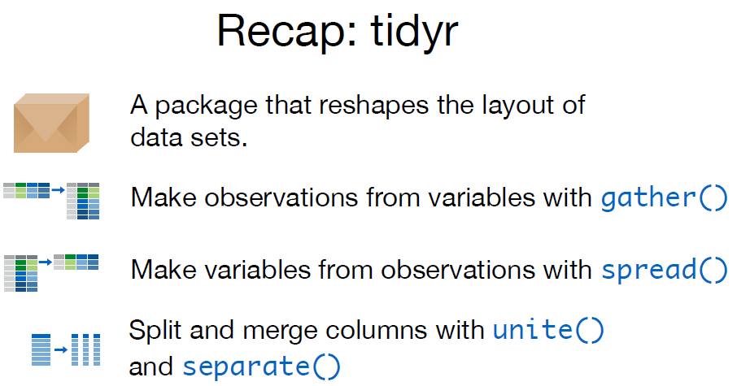
```


--

## dplyr

A package that helps transform tabular data.


> Data sets contain more information than they display

?select
?filter
?arrange
?mutate
?summarise
?group_by


