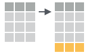
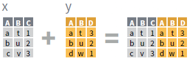
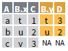

# Data Transformation


## dplyr

dplyr provides a grammar for manipulating tables in R. This cheat sheet will guide you through the grammar, reminding you how to select, filter, arrange, mutate, summarise, group, and join data frames and tibbles.


dplyr functions work with pipes and expect tidy data. 

pipes makes x %>% f(y) becomes f(x, y)


```{r}
# install.packages('nycflights13')

library(nycflights13)
library(tidyverse)
```

If you want to use the base version of these functions after loading dplyr, you'll need to use their full names: `stats::filter()` and `stats::lag()`.


`nycflights13::flights`. This data frame contains all `r format(nrow(nycflights13::flights), big.mark = ",")` flights that departed from New York City in 2013.

```{r}
flights
```

## dplyr basics

**key dplyr functions** :

* Pick observations by their values (`filter()`).
* Reorder the rows (`arrange()`).
* Pick variables by their names (`select()`).
* Create new variables with functions of existing variables (`mutate()`).
* Collapse many values down to a single summary (`summarise()`).


```{r echo = FALSE, out.width = "70%", fig.align='mid'}

```


These can all be used in conjunction with `group_by()` which changes the scope of each function from operating on the entire dataset to operating on it group-by-group. 

These six functions provide the verbs for a language of data manipulation.

All verbs work similarly: 

1.  The first argument is a data frame.
1.  The subsequent arguments describe what to do with the data frame,
    using the variable names (without quotes).
1.  The result is a new data frame.


## Summarise Cases

These apply summary functions to columns to create a new table of summary statistics. Summary functions take vectors as input and return one value.

```{r echo = FALSE, out.width = "70%", fig.align='mid'}

```


* summarise(.data, …) : Compute table of summaries.

<div class="grid-container">

<div class="grid-item">
```{r}
summarise(mtcars, avg = mean(mpg))
```
</div>
<div class="grid-item"></div>

</div>

* count(x, ..., wt = NULL, sort = FALSE) : Count number of rows in each group defined by the variables in … Also tally().

<div class="grid-container">
<div class="grid-item">
```{r eval=FALSE}
count(iris, Species)
```
</div>
<div class="grid-item"></div>

</div>


**VARIATIONS**

* summarise_all() - Apply funs to every column.
* summarise_at() - Apply funs to specific columns.
* summarise_if() - Apply funs to all cols of one type.

## Group Cases

Use group_by() to create a "grouped" copy of a table. dplyr functions will manipulate each "group" separately and then combine the results.


* group_by(.data, ..., add = FALSE) : Returns copy of table grouped by …

```
g_iris <- group_by(iris, Species)
```


* ungroup(x, …) : Returns ungrouped copyof table.
```
ungroup(g_iris)
```

<div class="grid-container">

<div class="grid-item">
```{r eval=FALSE}
mtcars %>%
group_by(cyl) %>%
summarise(avg = mean(mpg))
```
</div>
<div class="grid-item"></div>

</div>

## Manipulate Cases

**EXTRACT CASES**

Row functions return a subset of rows as a new table.

* filter(.data, …)

  Extract rows that meet logical criteria.

<div class="grid-container">

<div class="grid-item">
```{r eval=FALSE}
 filter(iris, Sepal.Length > 7)
```
</div>
<div class="grid-item"></div>

</div>


* distinct(.data, ..., .keep_all = FALSE) 

  Remove rows with duplicate values.

<div class="grid-container">

<div class="grid-item">
```{r eval=FALSE}
distinct(iris, Species)
```
</div>
<div class="grid-item"></div>

</div>

* sample_frac(tbl, size = 1, replace = FALSE, weight = NULL, .env = parent.frame()) : 

  Randomly select fraction of rows.

<div class="grid-container">

<div class="grid-item">
```{r eval=FALSE}
sample_frac(iris, 0.5, replace = TRUE)
```
</div>
<div class="grid-item"></div>

</div>

* sample_n(tbl, size, replace = FALSE, weight = NULL, .env = parent.frame()) 

  Randomly select size rows. 
  
<div class="grid-container">

<div class="grid-item">
```{r eval=FALSE}
sample_n(iris, 10, replace = TRUE)
```
</div>
<div class="grid-item"></div>

</div>  

* slice(.data, …) 

  Select rows by position.

<div class="grid-container">

<div class="grid-item">
```{r eval=FALSE}
slice(iris, 10:15)
```
</div>
<div class="grid-item"></div>

</div>  

* top_n(x, n, wt) 

  Select and order top n entries (by group if grouped data). 

<div class="grid-container">

<div class="grid-item">
```{r eval=FALSE}
top_n(iris, 5, Sepal.Width)
```
</div>
<div class="grid-item"></div>

</div>


**Logical and Boolean Operators**

```{r echo = FALSE, out.width = "70%", fig.align='left'}

```

**ARRANGE CASES**

* arrange(.data, …) 

  Order rows by values of a column or columns (low to high), use with desc() to order from high to low.
  
<div class="grid-container">

<div class="grid-item">
```{r eval=FALSE}
arrange(mtcars, mpg)
arrange(mtcars, desc(mpg))
```
</div>
<div class="grid-item"></div>

</div>

* add_row(.data, ..., .before = NULL, .after = NULL)

  Add one or more rows to a table.


<div class="grid-container">

<div class="grid-item">
```{r eval=FALSE}
add_row(faithful, eruptions = 1, waiting = 1)
```
</div>
<div class="grid-item"></div>

</div>


## Manipulate Variables

**EXTRACT VARIABLES**

Column functions return a set of columns as a new vector or table.

* pull(.data, var = -1) 

  Extract column values as a vector. Choose by name or index.
  
<div class="grid-container">

<div class="grid-item">
```{r eval=FALSE}
pull(iris, Sepal.Length)
```
</div>
<div class="grid-item"></div>

</div>


* select(.data, …)

  Extract columns as a table. Also select_if().

<div class="grid-container">

<div class="grid-item">
```{r eval=FALSE}
select(iris, Sepal.Length, Species)
```
</div>
<div class="grid-item"></div>

</div>

**Use these helpers with select ()**
```{r eval=FALSE}
select(iris, starts_with("Sepal"))
```

* contains(match)
* ends_with(match)
* matches(match)
* mpg:cyl
* -Species
* num_range(prefix, range)
* one_of(…)
* starts_with(match)


**MAKE NEW VARIABLES**

These apply vectorized functions to columns. Vectorized funs take vectors as input and return vectors of the same length as output.

```{r echo = FALSE, out.width = "50%", fig.align='left'}

```


* mutate(.data, …)

  Compute new column(s).

<div class="grid-container">

<div class="grid-item">
```{r eval=FALSE}
mutate(mtcars, gpm = 1/mpg)
```
</div>
<div class="grid-item"></div>

</div>

* transmute(.data, …)

  Compute new column(s), drop others.


<div class="grid-container">

<div class="grid-item">
```{r eval=FALSE}
transmute(mtcars, gpm = 1/mpg)
```
</div>
<div class="grid-item"></div>

</div>

* mutate_all(.tbl, .funs, …) 

  Apply funs to every column. Use with funs(). Also mutate_if().
  
<div class="grid-container">

<div class="grid-item">
```{r eval=FALSE}
mutate_all(faithful, funs(log(.), log2(.)))
mutate_if(iris, is.numeric, funs(log(.)))
```
</div>
<div class="grid-item"></div>

</div>  

* mutate_at(.tbl, .cols, .funs, …) 

  Apply funs to specific columns. Use with funs(), vars() and the helper functions for select().
  
<div class="grid-container">

<div class="grid-item">
```{r eval=FALSE}
mutate_at(iris, vars( -Species), funs(log(.)))
```
</div>
<div class="grid-item"></div>

</div>  

* add_column(.data, ..., .before = NULL, .after =
NULL) 

  Add new column(s). Also add_count(), add_tally(). 
  
  
<div class="grid-container">

<div class="grid-item">
```{r eval=FALSE}
add_column(mtcars, new = 1:32)
```
</div>
<div class="grid-item"></div>

</div>    
  
  
* rename(.data, …) 

  Rename columns.
 
<div class="grid-container">

<div class="grid-item">
```{r eval=FALSE}
rename(iris, Length = Sepal.Length) 
```
</div>
<div class="grid-item"></div>

</div>   


## Vector Functions

**TO USE WITH MUTATE ()**

mutate() and transmute() apply vectorized functions to columns to create new columns. Vectorized functions take vectors as input and return vectors of the same length as output.

* OFFSETS

  - dplyr::lag() - Offset elements by 1
  - dplyr::lead() - Offset elements by -1

<br>

* CUMULATIVE AGGREGATES

  - dplyr::cumall() 
  - dplyr::cumany() 
  - dplyr::cummax()
  - dplyr::cummean()
  - dplyr::cummin()
  - dplyr::cumprod()
  - dplyr::cumsum()

<br>

* RANKINGS

  - dplyr::cume_dist() - Proportion of all values <=
  - dplyr::dense_rank() - rank with ties = min, no gaps
  - dplyr::min_rank() - rank with ties = min
  - dplyr::ntile() - bins into n bins
  - dplyr::percent_rank() - min_rank scaled to [0,1]
  - dplyr::row_number() - rank with ties = "first"  

<br>

* MATH

  - +, - , *, /, ^, %/%, %% - arithmetic ops
  - log(), log2(), log10() - logs
  - <, <=, >, >=, !=, == - logical comparisons
  - dplyr::between() - x >= left & x <= right
  - dplyr::near() - safe == for floating point numbers

<br>

* MISC

  - dplyr::case_when() - multi-case if_else()
  - dplyr::coalesce() - first non-NA values by element across a set of vectors
  - dplyr::if_else() - element-wise if() + else()
  - dplyr::na_if() - replace specific values with NA
  - pmax() - element-wise max()
  - pmin() - element-wise min()
  - dplyr::recode() - Vectorized switch()
  - dplyr::recode_factor() - Vectorized switch() for factors


## Summary Functions

**TO USE WITH SUMMARISE ()**

summarise() applies summary functions to columns to create a new table. Summary functions take vectors as input and return single values as output.

* COUNTS
  - dplyr::n() - number of values/rows
  - dplyr::n_distinct() - # of uniques
  - sum(!is.na()) - # of non-NA’s

* LOCATION
  - mean() - mean, also mean(!is.na())
  - median() - median

* LOGICALS
  - mean() - Proportion of TRUE’s
  - sum() - # of TRUE’s

* POSITION/ORDER
  - dplyr::first() - first value
  - dplyr::last() - last value
  - dplyr::nth() - value in nth location of vector

* RANK
  - quantile() - nth quantile
  - min() - minimum value
  - max() - maximum value

* SPREAD
  - IQR() - Inter-Quartile Range
  - mad() - median absolute deviation
  - sd() - standard deviation
  - var() - variance


## Row Names

Tidy data does not use rownames, which store a variable outside of the columns. To work with the rownames, first move them into a column.

* rownames_to_column()

  Move row names into col.

<div class="grid-container">

<div class="grid-item">
```{r eval=FALSE}
a <- rownames_to_column(iris, var = "C")
```
</div>
<div class="grid-item"></div>

</div>   


* column_to_rownames()

  Move col in row names.

<div class="grid-container">

<div class="grid-item">
```{r eval=FALSE}
column_to_rownames(a, var = "C")
```
</div>
<div class="grid-item"></div>

</div>  

* has_rownames()

* remove_rownames()


## Combine Tables

**COMBINE VARIABLES**

* Use **bind_cols()** to paste tables beside each other as they are.bind_cols(…) Returns tables placed side by
side as a single table.

BE SURE THAT ROWS ALIGN.

```{r echo = FALSE, out.width = "50%", fig.align='left'}

```


* Use a **"Mutating Join"** to join one table to columns from another, matching values with the rows that they correspond to. Each join retains a different combination of values from
the tables.
  
<div class="grid-container">

<div class="grid-item">
```{r eval=FALSE}
left_join(x, y, by = NULL,
          copy=FALSE, suffix=c(“.x”,“.y”),…)
```
</div>
<div class="grid-item"><br></div>

<div class="grid-item">
```{r eval=FALSE}
right_join(x, y, by = NULL, 
           copy = FALSE, suffix=c(“.x”,“.y”),…)
```
</div>
<div class="grid-item"><br></div>

<div class="grid-item">
```{r eval=FALSE}
inner_join(x, y, by = NULL, 
           copy = FALSE, suffix=c(“.x”,“.y”),…)
```
</div>
<div class="grid-item"><br></div>

<div class="grid-item">
```{r eval=FALSE}
full_join(x, y, by = NULL,
          copy=FALSE, suffix=c(“.x”,“.y”),…)
```
</div>
<div class="grid-item"><br></div>
</div>  


* Use by = c("col1", "col2", …) to specify one or more common
columns to match on.

<div class="grid-container">

<div class="grid-item">
```{r eval=FALSE}
left_join(x, y, by = "A")
```
</div>
<div class="grid-item"></div>

</div>  

* Use a named vector, by = c("col1" = "col2"), to match on columns that have different names in each table.

<div class="grid-container">

<div class="grid-item">
```{r eval=FALSE}
left_join(x, y, by = c("C" = "D"))
```
</div>
<div class="grid-item"></div>

</div>  


* Use suffix to specify the suffix to give to unmatched columns that have the same name in both tables.


<div class="grid-container">

<div class="grid-item">
```{r eval=FALSE}
left_join(x, y, by = c("C" = "D"), suffix =
c("1", "2"))
```
</div>
<div class="grid-item"></div>

</div> 

**COMBINE CASES**


```{r echo = FALSE, out.width = "40%", fig.align='left'}

```

* Use **bind_rows()** to paste tables below each other as they are.

<div class="grid-container">

<div class="grid-item">
```{r eval=FALSE}
bind_rows(…, .id = NULL)
```
</div>
<div class="grid-item"><br></div>

<div class="grid-item">
```{r eval=FALSE}
intersect(x, y, …)
```
</div>
<div class="grid-item"><br></div>

<div class="grid-item">
```{r eval=FALSE}
setdiff(x, y, …)
```
</div>
<div class="grid-item"><br></div>

<div class="grid-item">
```{r eval=FALSE}
union(x, y, …)
```
</div>
<div class="grid-item"><br></div>
</div>  

* Use **setequal()** to test whether two data sets contain the exact same rows (in any order).


**EXTRACT ROWS**


```{r echo = FALSE, out.width = "40%", fig.align='left'}

```

* Use a **"Filtering Join"** to filter one table against the rows of another.


<div class="grid-container">

<div class="grid-item">
```{r eval=FALSE}
semi_join(x, y, by = NULL, …)
```
</div>
<div class="grid-item"><br></div>

<div class="grid-item">
```{r eval=FALSE}
anti_join(x, y, by = NULL, …)
```
</div>
<div class="grid-item"><br></div>

</div>


## Alternatives

There are two main alternatives to readr: base R and data.table's `fread()`. The most important differences are discussed below.

### Base R

Compared to the corresponding base functions, readr functions:

* Use a consistent naming scheme for the parameters (e.g. `col_names` and 
 `col_types` not `header` and `colClasses`).
 
* Are much faster (up to 10x).

* Leave strings as is by default, and automatically parse common 
  date/time formats.

* Have a helpful progress bar if loading is going to take a while.

* All functions work exactly the same way regardless of the current locale.
  To override the US-centric defaults, use `locale()`.

### data.table and `fread()`

[data.table](https://github.com/Rdatatable/data.table) has a function similar to `read_csv()` called fread. Compared to fread, readr functions:

* Are slower (currently ~1.2-2x slower. If you want absolutely the best 
  performance, use `data.table::fread()`.
  
* Use a slightly more sophisticated parser, recognising both 
  doubled (`""""`) and backslash escapes (`"\""`), and can produce
  factors and date/times directly.
  
* Forces you to supply all parameters, where `fread()` saves you work by
  automatically guessing the delimiter, whether or not the file has a
  header, and how many lines to skip.
  
* Are built on a different underlying infrastructure. Readr functions
  are designed to be quite general, which makes it easier to add 
  support for new rectangular data formats. `fread()` is designed to be 
  as fast as possible.
