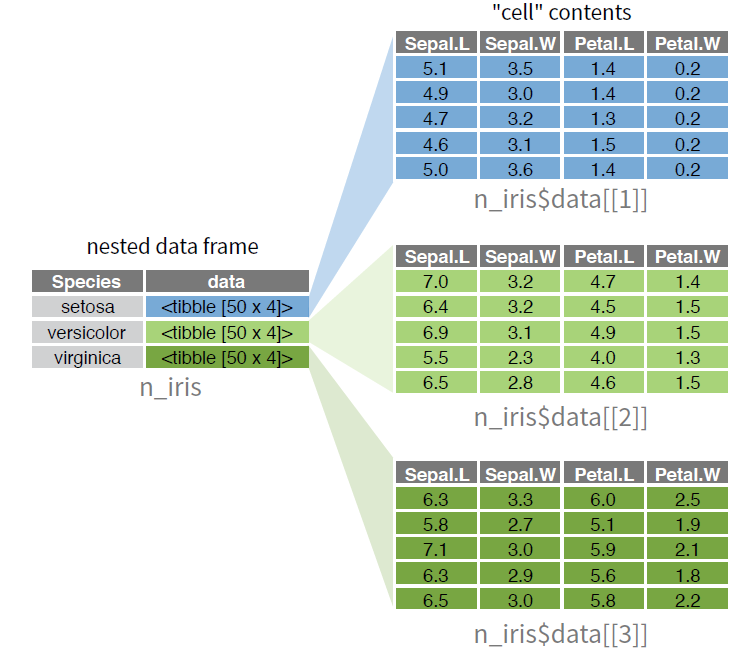
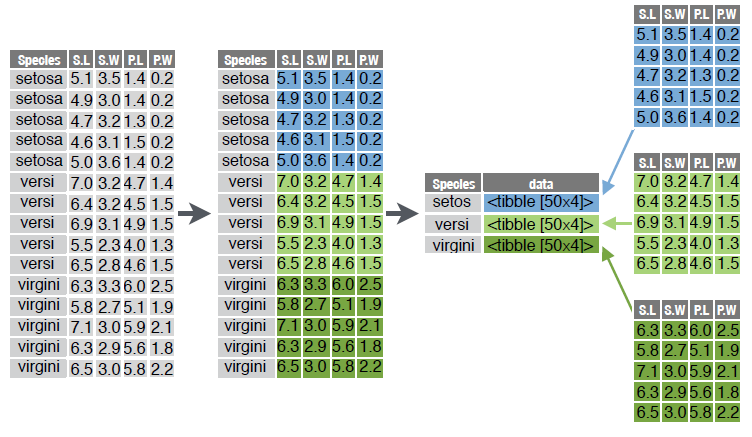
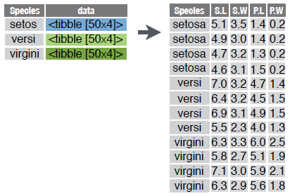
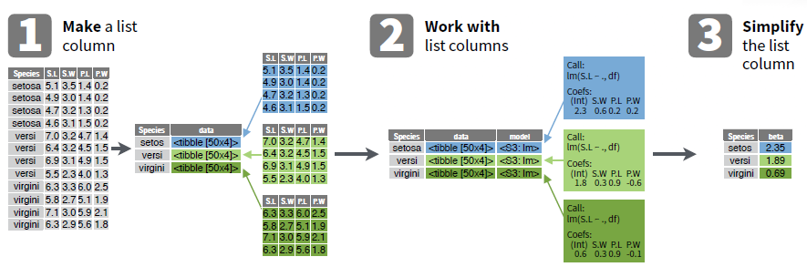
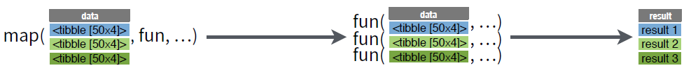
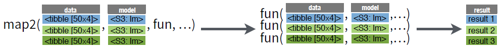
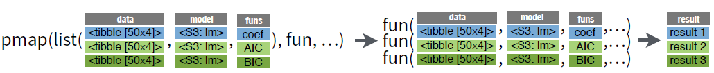
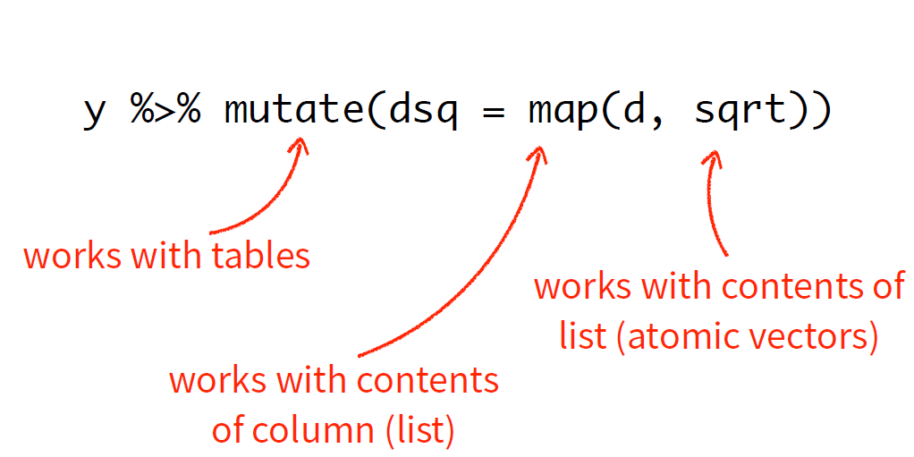
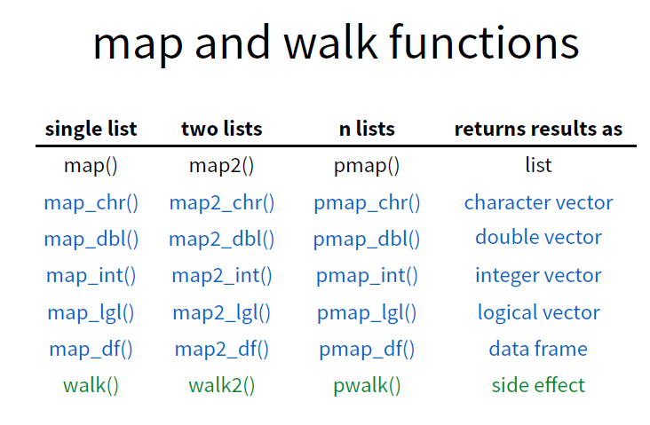

```{r setup, include=FALSE}
library(tidyverse) 
```

---

## Nested Data

* A nested data frame stores individual tables within the cells of a larger, organizing table.

* Use a nested data frame to:

    * preserve relationships between observations and subsets of data
    * manipulate many sub-tables at once with the purrr functions map(), map2(), or pmap().
    
```{r echo=FALSE, out.width='70%'}

```


---

### How to create a nested data frame:

1. Group the data frame into groups with dplyr::group_by()

2. Use nest() to create a nested data frame with one row per group

```{r c3, out.width='70%'}

```


---
### unnest()

```{r c5, out.width='70%'}

```

---

## List Columns


```{r c27}
knitr::include_graphics("image/tb03_list-column/listcolumn.png")
```

---

## List Column Workflow


```{r c7, out.width='100%'}

```


---
## WORK WITH LIST COLUMNS


```{r c17}

```


```{r c19}

```

  
```{r c21}

```

---

```{r c30}

```

---

## Simplify the List column

```{r c31}

```


---


