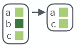
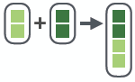

```{r setup, include=FALSE}
library(tidyverse) 
```

## purrr package

The **purrr package** makes it easy to work with lists and functions. This cheatsheet will remind you how to manipulate lists with purrr as well as how to apply functions iteratively to each element of a list or vector. The back of the cheatsheet explains how to work with list-columns. With **list columns**, you can use a simple data frame to organize any collection of objects in R. 


## Apply Functions


Map functions apply a function iteratively to each element of a list
or vector.


* map(.x, .f, …) : Apply a function to each element of a list or vector. 


<div class="row">

<div class="col-md-6">

```
x = c(TRUE,TRUE,FALSE)
map(x, is.logical)
```
</div>

<div class="col-md-6">


</div>

</div>


* map2(.x, ,y, .f, …): Apply a function to pairs of elements from two lists, vectors. 


<div class="row">

<div class="col-md-6">
```
map2(x, y, sum)
```
</div>

<div class="col-md-6">

</div>
</div>

* pmap(.l, .f, …) Apply a function to groups of
elements from list of lists, vectors. 

<div class="row">

<div class="col-md-6">
```
pmap(list(x, y, z), sum, na.rm = TRUE)
```
</div>

<div class="col-md-6">

</div>
</div>


* invoke_map(.f, .x = list(NULL), …, .env=NULL)
Run each function in a list. Also invoke. 

<div class="row">

<div class="col-md-6">
```
l <- list(var, sd); 
invoke_map(l, x = 1:9)
```
</div>

<div class="col-md-6">

</div>
</div>

* lmap(.x, .f, ...) Apply function to each list-element of a list or vector.

* imap(.x, .f, ...) Apply .f to each element of a list or vector and its index.


### OUTPUT

map(), map2(), pmap(), imap and invoke_map each return a list. 
Use a suffixed version to return the results as a specific type of flat
vector, e.g. map2_chr, pmap_lgl, etc.

Use walk, walk2, and pwalk to trigger side effects. Each return its input invisibly.

|function | returns
|:-------:|:-------------
|map      | list
|map_chr  | character vector
|map_dbl  | double (numeric) vector
|map_dfc  | data frame (column bind)
|map_dfr  | data frame (row bind)
|map_int  | integer vector
|map_lgl  | logical vector
|walk     | triggers side effects, returns the input invisibly

### SHORTCUTS - within a purrr function:

* "name" becomes function(x) x[["name"]], 
    - e.g. map(l, "a") extracts a from each element of l

* ~ .x becomes function(x) x,
    - e.g. map(l, ~ 2 +.x) becomes map(l, function(x) 2 + x )
    
* ~ .x .y becomes function(.x, .y) .x .y, 
    - e.g. map2(l, p, ~ .x +.y ) becomes map2(l, p, function(l, p) l + p )
    
* ~ ..1 ..2 etc becomes function(..1, ..2, etc) ..1 ..2 etc,
    - e.g. pmap(list(a, b, c), ~ ..3 + ..1 - ..2) becomes pmap(list(a, b, c), function(a, b, c) c + a - b)


## Work with Lists

### FILTER LISTS

* pluck(.x, ..., .default=NULL) : Select an element by name or index, pluck(x,"b") ,or its attribute with attr_getter.

<div class="row">

<div class="col-md-6">
```
pluck(x,"b",attr_getter("n"))
```
</div>

<div class="col-md-6">

</div>
</div>


* keep(.x, .p, …) : Select elements that pass a logical test. 

<div class="row">

<div class="col-md-6">
```
keep(x, is.na)
```
</div>

<div class="col-md-6">

</div>
</div>


* discard(.x, .p, …) Select elements that do not pass a logical test. 

<div class="row">

<div class="col-md-6">
```
discard(x, is.na)
```
</div>

<div class="col-md-6">

</div>
</div>


* compact(.x, .p = identity) Drop empty elements.

<div class="row">

<div class="col-md-6">
```
compact(x)
```
</div>

<div class="col-md-6">

</div>
</div>


* head_while(.x, .p, …) Return head elements until one does not pass.
Also tail_while.

<div class="row">

<div class="col-md-6">
```
head_while(x, is.character)
```
</div>

<div class="col-md-6">

</div>
</div>


### SUMMARISE LISTS


* every(.x, .p, …) Do all elements pass a test?

<div class="row">

<div class="col-md-6">
```
every(x, is.character)
```
</div>

<div class="col-md-6">

</div>
</div>

* some(.x, .p, …) Do some elements pass a test?


<div class="row">

<div class="col-md-6">
```
some(x, is.character)
```
</div>

<div class="col-md-6">

</div>
</div>

* has_element(.x, .y) Does a list contain an element?

<div class="row">

<div class="col-md-6">
```
has_element(x, "foo")
```
</div>

<div class="col-md-6">

</div>
</div>

* detect(.x, .f, ..., .right=FALSE, .p) Find first element to pass.

<div class="row">

<div class="col-md-6">
```
detect(x, is.character)
```
</div>

<div class="col-md-6">

</div>
</div>

* detect_index(.x, .f, ..., .right = FALSE, .p) Find index of first element to pass.

<div class="row">

<div class="col-md-6">
```
detect_index(x, is.character)
```
</div>

<div class="col-md-6">

</div>
</div>


* vec_depth(x) Return depth(number of levels of indexes). 


<div class="row">

<div class="col-md-6">
```
vec_depth(x)
```
</div>

<div class="col-md-6">


</div>

</div>


### TRANSFORM LISTS

* modify(.x, .f, ...) Apply function to each element. Also map, map_chr, map_dbl,
map_dfc, map_dfr, map_int,map_lgl. 

<div class="row">
<div class="col-md-6">
```
modify(x, ~.+ 2)
```
</div>
<div class="col-md-6">

</div>

</div>


* modify_at(.x, .at, .f, ...) Apply function to elements by name or index. Also map_at.

<div class="row">
<div class="col-md-6">
```
modify_at(x, "b", ~.+ 2)
```
</div>

<div class="col-md-6">

</div>

</div>


* modify_if(.x, .p, .f, ...) Apply function to elements that pass a test. Also map_if.

<div class="row">
<div class="col-md-6">
```
modify_if(x, is.numeric,~.+2)
```
</div>
<div class="col-md-6">

</div>

</div>

* modify_depth(.x,.depth,.f,...) Apply function to each element at a given level of a list. 


<div class="row">
<div class="col-md-6">
```
modify_depth(x, 1, ~.+ 2)
```
</div>
</div>


### RESHAPE LISTS

* flatten(.x) Remove a level of indexes from a list. Also flatten_chr, flatten_dbl, flatten_dfc, flatten_dfr, flatten_int, flatten_lgl.

<div class="row">

<div class="col-md-6">
```
flatten(x)
```
</div>

<div class="col-md-6">

</div>
</div>

* transpose(.l, .names = NULL) Transposes the index order in a multi-level list.

<div class="row">

<div class="col-md-6">
```
transpose(x)
```
</div>

<div class="col-md-6">

</div>
</div>


### JOIN (TO) LISTS

* append(x, values, after = length(x)) Add to end of list.

<div class="row">

<div class="col-md-6">
```
append(x, list(d = 1))
```
</div>

<div class="col-md-6">

</div>
</div>

* prepend(x, values, before =1) Add to start of list.

<div class="row">

<div class="col-md-6">
```
prepend(x, list(d = 1))
```
</div>

<div class="col-md-6">

</div>
</div>

*splice(…) Combine objects into a list, storing S3 objects as sub-lists. 

<div class="row">

<div class="col-md-6">
```
splice(x, y, "foo")
```
</div>

<div class="col-md-6">

</div>
</div>


### WORK WITH LISTS

* array_tree(array, margin = NULL) Turn array into list. Also array_branch.

<div class="row">

<div class="col-md-6">
```
array_tree(x, margin = 3)
```
</div>

<div class="col-md-6">
</div>
</div>

* cross2(.x, .y, .filter = NULL) All combinations of .x and .y. Also cross, cross3, cross_df. 

<div class="row">

<div class="col-md-6">
```
cross2(1:3, 4:6)
```
</div>

<div class="col-md-6">

</div>
</div>

*  set_names(x, nm = x) Set the names of a vector/list directly or with a function.

<div class="row">

<div class="col-md-6">
```
set_names(x, c("p", "q", "r"))
set_names(x, tolower)
```
</div>

<div class="col-md-6">

</div>
</div>


## Reduce Lists

* reduce(.x, .f, ..., .init) Apply function recursively to each element of a list or vector. Also reduce_right, reduce2, reduce2_right.

<div class="row">

<div class="col-md-6">
```
reduce(x, sum)
```
</div>

<div class="col-md-6">

</div>
</div>

* accumulate(.x, .f, ..., .init) Reduce, but also return intermediate results. Also accumulate_right.

<div class="row">

<div class="col-md-6">
```
accumulate(x, sum)
```
</div>

<div class="col-md-6">

</div>
</div>


## Modify function behavior

* compose() Compose multiple functions.

* lift() Change the type of input a function takes. Also lift_dl,
lift_dv, lift_ld, lift_lv, lift_vd, lift_vl.

* rerun() Rerun expression n times.

* negate() Negate a predicate function (a pipe friendly !)

* partial() Create a version of a function that has some args preset to values.

* safely() Modify func to return list of results and errors.

* quietly() Modify function to return list of results, output, messages, warnings.

* possibly() Modify function to return default value whenever an error occurs (instead of error).


